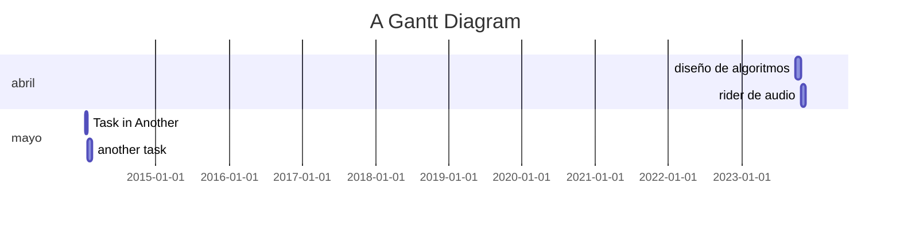

<<<<<<< HEAD

=======
<iframe src="https://sdxl-h-p-1.stablediffusionweb.com/file=/tmp/gradio/709630ab5a0dc11796594ab4d6bc3f838acaa479/image.png" allow="fullscreen" allowfullscreen="" style="height:100%;width:100%; aspect-ratio: 16 / 9; "></iframe>

## La conciencia o el destino a morir
>>>>>>> origin/main
# Síntesis
lectura del movimiento de las plantas en una instalación 

# Objetivos

# Desarrollo
Una instalación estará provista con 43 mesas de distintas alturas. Sobre ellas los participantes deben depositar una planta a elección ( helechos, potus, portulacas, pelargonios, etc). Hacia cada mesa estará dirigido un equipo de laser que detectará el movimiento de las plantas. Cada mesa tendrá numeración y estará conectada a un sillón el cual provee unos auriculares. EL laser detecta el movimiento de las plantas y estos lo traducen en sonido.

> VINCULO 

# titulo
- restringe la polisemia.
- es un puente entre la abstracción y el mundo real. 
- clickbait
## subtitulo
- nunca es redundante.
- es un espacio de complicidad entre la creación y la recepción. 
- tiene una condición de verdad pero no garantiza una sola direccionalidad del mensaje. 
- es anti-formal, puede negar o afirmar la forma. 
- tipos: nombre propio ,  somático , procedimiento. 

![[Pasted image 20220906234521.png]]

# síntesis
- está formada por 1 a 3 oraciones. 
# objetivos  
- entre 3 y 5. 
-  marcar un interés principal y otros secundarios. 
# justificación / memoria conceptual
       imaginario especulativo. 
- contexto
- estado del arte [bibliografía comentada]
- paradigma  
- motivación 
# desarrollo
- desglose o explicación de la cosa.
- funcionamiento [horas de apertura, comportamiento del público]
# desarrollo del trabajo.
# cronograma
- etapas  

# materiales
- rider
- planos
- lista de materiales
- presupuesto
	- 
# referencias
- bibliografia