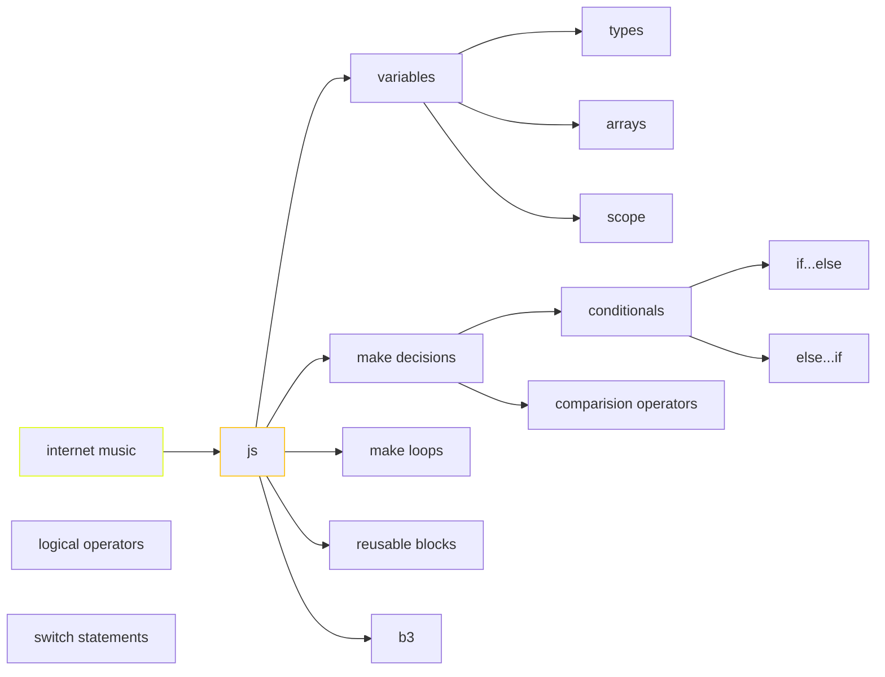

```mermaid
graph LR

a[internet music]
b[js]
b0[variables]
b01[types]
b02[arrays]
b03[scope]
b1[make decisions]
b11[conditionals]
b111[if...else]
b112[else...if]
b12[comparision operators]
b13[logical operators]
b14[switch statements]
b2[make loops]
b4[reusable blocks]


a --> b 
b --> b0 & b1 & b2 & b3 & b4
b0 --> b01 & b02 & b03
b1 --> b11 & b12
b11 --> b111 & b112 


classDef default stroke-width:1px;
classDef c1 stroke:#DFFF00;
classDef c2 stroke:#FFBF00;
classDef c3 stroke:#FF7F50;
classDef c4 stroke:#DE163;
classDef c5 stroke:#40E0D0;
classDef c6 stroke:#CCCCFF;

class a c1;
class b c2;
class c c3;


```


# variables
```javascript

var a = 10;
var b = 12;
console.log (a + b)

```


```
# librerias
## tone.js

