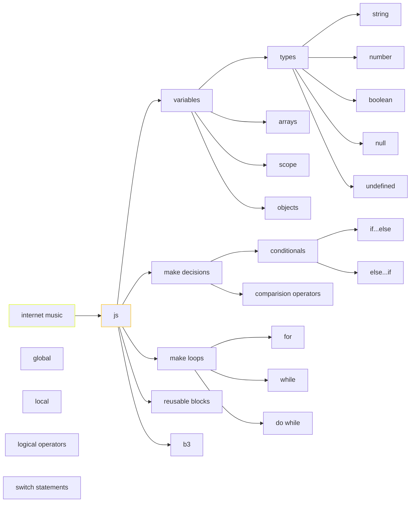

> [!important] > Atención! para correr los snippets de javascript es necesario ir a configuración del plugin Executc de node.js. (ademas de tener instalado node.js) En windows la ruta es C:\Program Files\nodejs\node.exe





## breve intro

La primera aparición pública de Javascript la encontramos en el año 1995 cuando se utiliza como herramienta del navegador Netscape Navigator, con el objetivo de agregar programas a páginas web.

## palabras reservadas
```js
break, case, catch, continue, default, let
delete, do, else, finally, for, function, if, in, instanceof, new, return, switch, this, throw, try, typeof, var, void, while, with
```


## variables
un espacio de memoria asignable mediante un nombre y un valor. Tres aspectos fundamentales de las variable en js son: los tipos (enteros, reales, cadenas de texto, boleanos, null y undefined),  el scope y el uso de variables como objetos. 

```javascript

var a = 10;
var b = 12;
console.log (a + b)

var  f = true;

```
Una variable **let** puede recibir múltiples asignaciones en el transcurso de la aplicación, es decir que puede cambiar de valor varias veces. Una constante **const** recibe una única asignación al momento de su declaración, impidiendo que su valor se modifique luego.

### String
Secuencia de texto en cadena

```js

let miVariable = 'myNote';
```

### Number

Esto es un número. Los números no tienen comillas.

```js
let miVariable = 440;
```


### Boolean

Tienen valor true/false

```js

let miVariable = true;
```

#### operaciones básicas

```js
	let  textoA = "acorde";
    let   textoB = "RE";
    const BLANCO = " ";

    let resultadoA = textoA + textoB; //acordeRE
```


## control de flujos

El control de flujos es marcar puntos donde, a partir de alguna evaluación, el devenir del código pueda tomar varios caminos posibles de acción.

Para ello se utilizan los valores **booleanos** (true or false)

### condicionales
```js
if (condición) {
  código a ejecutar si la condición es verdadera
} else {
  ejecuta este otro código si la condición es falsa
}
```
### operadores lógicos
```javascript
'=' //Igual a
!= //Diferente a 
=== //Contenido y tipo igual a 
!== //Contenido o tipo diferente de 
> //Mayor que 
>= //Mayor o igual que 
< //Menor que 
⇐ //Menor o igual que

//operadores lógicos
&& //and
|| //or
! //not
```

```js
let freq = 440; //podría ser modificable mediante otra función, por ejemplo, un valor de un form accediendo al DOM

if (freq < 440) {
    funcion(1);
}

else if (precio < 440) {
    funcion(2);
}

else if (precio = 440) {
    funcion(3);
}

else {
    funcion(4);
}
```
## ciclos
Los ciclos, también bucles o iteraciones son un medio rápido y sencillo para hacer algo repetidamente.

### ciclos por conteo
Repiten un bloque de código un número de veces específica. Estructura **for**. 

```js
for(desde; hasta; actualización) {
 //lo que se escriba acá se ejecutará mientras dure el ciclo
}
```

```js 
for (let i = 0; i < 10; i++) {
    alert(i);
}
//Ejecuta el bucle y da el resultado y va actualizando
//1 = 0
//luego,
//1 = 1
//luego... 
//1 = 2
```

Para que bajo cierta condición, el ciclo se interrumpa como si hubiese finalizado se utiliza la sentencia **break**
```js

for (let i=0; i <= 10; i++) {
if(i ==5){
break;
}

alert (i);
}
```

Por el contrario, la sentencia **continue**, pero en vez de interrumpir, la saltea y continúa

### ciclos condicionales
Repiten un bloque de código mientras la condición evaluada es verdadera. Estructuras **while** y **do...while**.

```js
while (algo, operador lógico, otro) {
	función();
}
```

```js
let entrada = prompt("Ingresar un dato");
//Repetimos con While hasta que el usuario ingresa "ESC"

while(entrada != "ESC" ){

    alert("El usuario ingresó "+ entrada);

    //Volvemos a solicitar un dato. En la próxima iteración se evalúa si no es ESC.

    entrada = prompt("Ingresar otro dato");
}
```

## switch
Maneja múltiples condiciones sobre la misma variable (técnicamente se podría resolver con un if, pero el uso de switch es más ordenado)

```js
switch(numero) {
 case 5:
   ...
   break;
 case 8:
   ...
   break;
 case 20:
   ...
   break;
 default:
   ...
   break;
} //cada condición se evalúa y, si se cumple, se ejecuta lo que esté indicado dentro de cada case, después de las instrucciones de cada case se incluye la sentencia break para terminar la ejecución del switch
```


## funciones
Conjunto de instrucciones que se agrupan para realizar una tarea concreta

```js
const synth = new Tone.Synth().toDestination();

//declaración
function tone () {
  synth.triggerAttackRelease("C4", "1"); //en segundos
  synth.volume.value = -30;
}

//llamado
tone();
```

### parámetros

Son variables que se declaran dentro de la función, entre sus paréntesis. Los valores de éstos se definen luego en el llamado.

```js
function conParametros(parametro1, parametro2) {
    console.log(parametro1 + " " + parametro2);
}
```

El valor que toman estos parámetros se definen en el **llamado**. 
```js
conParametros("generative", "art"); // → “generative art”
```

### return
Retorna un valor que se puede guardar en una variable. Por ej el prompt devuelve algo y solemos guardarlo en una variable. En cambio, el console.log, no. La sentencia **return** finaliza la ejecución de la función y especifica un valor para ser devuelto a quien llama a la función.

### console.log() 
La sentencia console.log() muestra el mensaje que pasemos como parámetro a la llamada en la consola JavaScript del Navegador web.

```js
console.log("el audioCtx está inicializado");

let acorde = “RE”
    console.log(acorde) //RE
```

### funciones anónimas
Se define sin nombre y se utiliza para ser pasada como parámetro o asignada a una variable. En el caso de asignarla a una variable, se puede llamar usando el identificador de la variable declarada.

```js
//Generalmente, las funciones anónimas se asignan a variables declaradas como constantes
const suma  = function (a, b) { return a + b }
const resta = function (a, b) { return a - b }

console.log( suma(15,20) )
console.log( resta(15,5) )
```
### funciones flecha
Funciones anónimas de sintaxis simplificada. Están disponibles desde la versión ES6 de JavaScript, no usan la palabra function pero usa ⇒ (flecha) entre los parámetros y el bloque.

```js
const suma  = (a, b) ⇒ { return a + b }
//Si es una función de una sola línea con retorno podemos evitar escribir el cuerpo.
const resta = (a, b) ⇒  a - b ;
console.log( suma(15,20) )
console.log( resta(20,5) )
```

> [!info] No puedo ejecutar una función sin antes declararla (tipo flecha/arrow function o anónima), pero sí en la forma clásica, ya que el programa ubica a todas las funciones con la palabra reservada '**function**' y las coloca por encima de todo.
## scope
Zona del programa en la cual se define, el contexto al que pertenece la misma dentro de un algoritmo, restringiendo su uso y alcance. Puede ser **global** o **local**.
```js
let nota = “RE” // variable global

function escala() {
    let nota = “DO” // variable local
    console.log(nota)
}

//Accede a nombre global
console.log(nota)   // RE
  

//Accede a nombre local
escala() // DO
```

## objetos

Son estructuras que podemos definir para agrupar valores bajo un mismo criterio. Es una colección de datos relacionados como una entidad. Se componen de un listado de pares clave-valor, es decir, contienen propiedades y valores agrupados.
```js
let freq = 440;
let dinamica   = "pp";
let instrumento  = "flauta2";

const sonido1 = { freq: 440, dinamica: "pp", instrumento: "flauta" }

//para obtener el valor de una propiedad del objeto
console.log(sonido1.dinamica)
//otra forma
console.log(sonido1["dinamica"])

//para asignar nuevos valores
sonido1["instrumento"] = "piano"
//otra forma
sonido1.freq = 880
```
Para crear un objeto adentro de otro:
```js
const sonido1 = {
	freq: 440, //los VALORES en cada ATRIBUTO puede ser string, booleano, numérico, etc.
	dinamica: "pp", 
	instrumento: "flauta",
	efecto: { //creo otro objeto dentro de AUTO con sus propios atributos
		reverb: 20,
		delay: 150,
	},
};
```
Y para acceder a sus atributos, también separados con puntos:
```js
console.log(sonido1.efecto.delay);
```
### constructores
Es una función que usamos para crear un nuevo objeto cada vez que sea necesario. Con esta “función constructora” podemos inicializar las propiedades del objeto al momento de ser **instanciado** con new.

```js
function Sonido(freq, dinamica, timbre) {
    this.freq = freq;
    this.dinamica = dinamica;
    this.instrumento  = instrumento;
}

const sonido1 = new Sonido(440, "forte", "violoncello"); //aquí, sonido1 es una instancia del objeto Sonido
const sonido2 = new Sonido(880, "piano", "violin"); //aquí, sonido2 es otra instancia del objeto Sonido
```
> [!warning] ¡¡NO con las ARROW FUNCTIONS porque NO tiene el contexto de this!!

#### this
Refiere al elemento actual en el que se está escribiendo el código. Cuando se emplea un función constructora para crear un objeto (con la palabra clave new), **this** está enlazado al nuevo objeto instanciado.

### métodos
(de los objetos) también son técnicamente funciones, sólo que se limitan a poder ser ejecutados solo desde el mismo objeto.

JavaScript cuenta con sus propios objetos (por ej, al crear un string se crea automáticamente como una instancia del objeto String y, por lo tanto, tiene varios métodos/propiedades comunes disponibles)
```js
let string = "hola mundo";
//Propiedad de objeto String: Largo de la cadena.
console.log(cadena.length);
//Método de objeto String: Pasar a minúscula.
console.log(cadena.toLowerCase());
//Método de objeto String: Pasar a mayúscula.
console.log(cadena.toUpperCase());
```

#### métodos personalizados
Llamar a un método es similar a acceder a una propiedad, pero se agrega () al final del nombre del método, posiblemente con argumentos.

```js
function Sonido(freq, dinamica, timbre) {
    this.freq = freq;
    this.dinamica = dinamica;
    this.instrumento  = instrumento;
    this.console = function() { console.log("la frecuencia es " + this.freq)}
}

const sonido1 = new Sonido(440, "forte", "violoncello");
const sonido2 = new Sonido(880, "piano", "violin");

sonido1.console();
sonido2.console();
```

### operador IN y FOR...IN
**in** devuelve true si la propiedad especificada existe en el objeto. 

El bucle **for...in** permite acceder a todas las propiedades del objeto, obteniendo una propiedad por cada iteración.

```js
const sonido1 = { freq: 440, dinamica: "pp", instrumento: "flauta" }

console.log( "freq" in sonido1); //devuelve true

console.log ("duracion" in sonido1); //devuelve false

//recorre todas las propidades del objeto sonido1
for (const propiedad in sonido1) {
	console.log(sonido1{propiedad});
}
```

### clases

Son una equivalencia al empleo de función constructora y permite definir distintos tipos de métodos. 

```js
class Sonido {
	constructor(freq, dinamica, instrumento){
	    this.freq = freq;
	    this.dinamica = dinamica;
	    this.instrumento  = instrumento;
	}
	    escribir() { //es un método de la función y puede tener su return
		    console.log("la frecuencia es " + this.freq)
		}
}

const sonido1 = new Sonido(440, "forte", "violoncello");// y aquí instanciamos
```

## objeto Math
Contenedor de herramientas y métodos para realizar operaciones matemáticas
```js
console.log('Math de E' + Math.E ) // 2.718281828459045
//otra forma template string, `string ${codigo javascript}`
console.log( `Math de PI con template string ${Math.PI} ` ) // 3.141592653589793
```

### Math.min() y Math.max()
```js
console.log( Math.max(55, 13, 0, -25, 93, 4) );//93
console.log( Math.min(55, 13, 0, -25, 93, 4) );//-25
//también existe Infinity o -Infinity
```

### Math.ceil(), Math.floor(), Math.round()
```js
console.log( Math.ceil(pi)) //4 el entero mayor o igual más próximo
console.log( Math.floor(pi)) //3 el entero más cercano redondeado hacia abajo
console.log( Math.round(pi)) //3 al entero más cercano
```
### Math.sqrt()
Retorna la raíz cuadrada de un número
```js
Math.sqrt(9); //3
```
### Math.random()
```js
Math.random(); //número aleatorio
console.log(Math.random() * 10); //entre 0 y 10
console.log(Math.random() * 30 + 20); //entre 20 y 50
```
```js
console.log(Math.round(Math.random() * 30 + 20)); //redondea el Math.random() de entre 20 y 50

//o bien en una función
const generadorNumero = () => {
	return Math.round (Math.random() * 100*)
}
console.log(generadorNumero() );

//o bien con toFixed
console.log((Math.random() * 30 + 20).toFixed(2)); //con 2 decimales
```
### constantes
|Constante|Descripción|Valor|
|---|---|---|
|`Math.E`|[Número de Euler](https://es.wikipedia.org/wiki/N%C3%BAmero_e)|`2.718281828459045`|
|`Math.LN2`|Equivalente a `Math.log(2)`|`0.6931471805599453`|
|`Math.LN10`|Equivalente a `Math.log(10)`|`2.302585092994046`|
|`Math.LOG2E`|Equivalente a `Math.log2(Math.E)`|`1.4426950408889634`|
|`Math.LOG10E`|Equivalente a `Math.log10(Math.E)`|`0.4342944819032518`|
|`Math.PI`|[Número PI](https://es.wikipedia.org/wiki/N%C3%BAmero_%CF%80) o `Π`|`3.141592653589793`|
|`Math.SQRT1_2`|Equivalente a `Math.sqrt(1/2)`.|`0.7071067811865476`|
|`Math.SQRT2`|Equivalente a `Math.sqrt(2)`.|`1.4142135623730951`|

### funciones y métodos
|Método|Descripción|Ejemplo|
|---|---|---|
|`Math.abs(x)`|Devuelve el [valor absoluto](https://es.wikipedia.org/wiki/Valor_absoluto) de `x`.|`\|x\|`|
|`Math.sign(x)`|Devuelve el signo del número: `1` positivo, `-1` negativo|   |
|`Math.exp(x)`|[Exponenciación](https://es.wikipedia.org/wiki/Exponenciaci%C3%B3n). Devuelve el número `e` elevado a `x`.|`e``x`|
|`Math.expm1(x)`|Equivalente a `Math.exp(x) - 1`.|`e``x``-1`|
|`Math.max(a, b, c...)`|Devuelve el número más grande de los indicados por parámetro.||
|`Math.min(a, b, c...)`|Devuelve el número más pequeño de los indicados por parámetro.||
|`Math.pow(base, exp)`|[Potenciación](https://es.wikipedia.org/wiki/Potenciaci%C3%B3n). Devuelve el número `base` elevado a `exp`.|`base``exp`|
|`Math.sqrt(x)`|Devuelve la [raíz cuadrada](https://es.wikipedia.org/wiki/Ra%C3%ADz_cuadrada) de `x`.|`√x`|
|`Math.cbrt(x)`|Devuelve la [raíz cúbica](https://es.wikipedia.org/wiki/Ra%C3%ADz_c%C3%BAbica) de `x`.|`√``3``x`|
|`Math.imul(a, b)`|Equivalente a `a * b`, pero a nivel de bits.||
|`Math.clz32(x)`|Devuelve el número de ceros a la izquierda de `x` en binario (32 bits).|

#### método Math.random()
Devuelve un número al azar entre 0 y 1 con 16 decimales.

#### métodos de redondeo
```js
// Redondeo natural, el más cercano
Math.round(3.75);           // 4
Math.round(3.25);           // 3

// Redondeo superior (el más alto)
Math.ceil(3.75);            // 4
Math.ceil(3.25);            // 4

// Redondeo inferior (el más bajo)
Math.floor(3.75);           // 3
Math.floor(3.25);           // 3

// Redondeo con precisión
Math.round(3.123456789);    // 3
Math.fround(3.123456789);   // 3.1234567165374756

// Truncado (sólo parte entera)
Math.trunc(3.75);           // 3
Math.round(-3.75);          // -4
Math.trunc(-3.75);          // -3
```

## arrays

Permite almacenar varios valores en una sola referencia.
Cada posición del array (==índice==) tiene un número, que abarca desde el 0 hasta toda la longitud. A su vez, se pueden sacar y agregar elementos.
```javascript
var notas=["C","C#","D","D#", "E","F","G","G#","A","A#","B"]

var total = notas.length;

console.log ("listar toda la escala :", notas, "\n" , 
			'la cantidad de notas es :', total, "\n",
			'la tercera nota es : ', notas[3], "\n", 
			'la posición de la nota F es : ', notas.lastIndexOf('F'), "\n",
			'las tres últimas notas som : ',notas.slice(total-3,total), "\n",
			'la escala retrógrada es : ', notas.reverse(), '\n',

			'la escala contiene un Bb : ', notas.includes('Bb'), "\n",
		    'la escala contiene un G# : ', notas.includes('G#')
)


```

```javascript
var notas=["C","C#","D","E","F","G","A","B"]

console.log ("listar toda la escala", notas)

```

Para llamar a cada valor del array: 
```js
notas[0], notas[1]
```
etc.

==length== es un método de un array: su longitud

### Recorrido de un array
```js
const freq = [1,2,3,4,5];
for (let i = 0; i < 5; i++) {
console.log (freq[i]); 
} 

const freq = [1,2,3,4,5];
for (let i = 0; i < freq.length; i++) { //para recorrer todos sus elementos pongo i < freq.length
console.log (freq[i]);
} 
```

### Agregar/quitar otro elemento
```js
freq.push(440); //agrega al final del array

freq.unShift(3456434); //al comienzo, por ende 'empuja' el resto de los valores

freq.shift(); //quita al primero

freq.pop(); //quita el último

freq.splice(1, 2); //funciona con dos parámetros, el primero es el índice donde se ubica el método a trabajar, y el segundo la cantidad de elementos a eliminar

console.log( freq.join (", ")); //une los parámetros del array, y su parámtro es a través de qué elemento se joinea
	console.log( freq.join (" * "));
```

```js
const altura = ['pupi', 'ronnie'];
const freq = ['mishi', 'garfield'];
const sonido = altura.concat(freq);
console.log(sonido);//concatena 2 arrays en 1

const instrumentos = ['flauta', 'oboe'];
const sonido2 = instrumentos.slice(1, 3);//sus parámetros son el inicio y el final
//slice devuelve una copia de una parte del array dentro de un nuevo array, empezando por el inicio hasta el fin (no incluido)

console.log( sonido2.indexOf('piano')) //0
//obtiene el índice de un elemento del array; si el elemento no existe, devuelve -1

console.log( sonido2.includes('oboe')) //true
//valor booleano respecto si existe o no ese elemento en el array

sonido2.reverse() //cambia el array original e invierte su orden (no es copia!)
console.log(sonido2)
```

### Array de objetos

Los array pueden usarse para almacenar objetos personalizados. Podemos asignar objetos literales o previamente instanciados en la declaración del array o agregar nuevos objetos usando el método push y el constructor.

```js
const sonido1 = { freq: 440, dinamica: "pp", instrumento: "flauta" }
const array = [sonido1, { freq: 880, dinamica: "f", instrumento: "oboe" }];

array.push({ freq: 1320, dinamica: "p", instrumento: "piano", estado { descripcion: "disponible" }});
```

### For... of
Permite recorrer un array ejecutando un bloque de código por cada elemento del objeto.
```js
for (const sonido of array){//por cada objeto del array
console.log(sonido); //palabra lo mas relacionado posible
}
```

## Higher order functions
Retorna una función o recibe una función por parámetro.
```js
function mayorQue(n) {
    return (m) ⇒ m > n
}

let mayorQueDiez = mayorQue(10)

console.log( mayorQueDiez(12) )  //  true
console.log( mayorQueDiez(8) )  //  false
//mayorQue(n) retorna una función que compara un valor contra n y retorna true o false (porque es el resultado de la comparación).
```

### Recibir funciones por parámetros

```js
function porCadaUno(arr, functionAEjecutar) { //fn=console.log()
    for (const el of arr) {//va a recorrer todos los elementos del array
        funcionAEejecutar(el); //console.log(1), la prox 2, luego 3, hasta 4
    }
}

const numeros= [1,2,3,4];
porCadaUno(numeros, console.log); //Podemos enviar funciones diferentes en distintos llamados y ejecutar distintas acciones sobre los elementos del array, todo con una misma función.

let total = 0

function acumular(num) {
    total += num
}

porCadaUno(numeros, acumular)
console.log(total) // 10
```

También en las arrow function
```js
const duplicado = []

porCadaUno(numeros, (el)⇒ {
    duplicado.push(el * 2)
})

console.log(duplicado) // [2, 4, 6, 8]
```

#### Métodos de búsqueda y transformación

##### forEach()
Recorre todos los elementos de un array, recibe una función anónima y ésta recibe cada elemento del array.
```js
const numeros = [1, 2, 3, 4, 5]

numeros.forEach( (num)=> {
	console.log(num+1); //a cada elemento le va a sumar 1 y lo imprime
});
```
##### find()
Recibe una función de comparación por parámetro (devuelve true o false y retorna el primer elemento que cumpla con esa condición)
```js
const sonidos = [
	{instrumento: 'flauta', freq: 440},
	{instrumento: 'oboe', freq: 880},
				]
const resultado = sonidos.find((el) ⇒ el.instrumento == "flauta")
const resultado2 = sonidos.find ((el) ⇒ el.instrumento == "piano")

console.log(resultado) //{nombre: 'flauta', precio: 440}
console.log(resultado2) //undefined
```
##### filter()
Recibe una función de comparación por parámetro y retorna un nuevo array todos los elementos que cumplan esa condición (sino devuelve un array vacio)
```js
const sonidos = [
	{instrumento: 'flauta', freq: 440},
	{instrumento: 'oboe', freq: 880},
	{instrumento: 'vln', freq: 350},
				]
const resultado = sonidos.filter((el) ⇒ el.instrumento.includes == "vln") //includes es un método de un string
const resultado2 = sonidos.filter((el) ⇒ el.freq == 440)


console.log(resultado)
console.log(resultado2)
```
##### some()
Igual que find() pero retorna un true o false
```js
const sonidos = [
	{instrumento: 'flauta', freq: 440},
	{instrumento: 'oboe', freq: 880},
	{instrumento: 'vln', freq: 350},
				]
const respuesta = sonidos.some((el) ⇒ el.instrumento == "vln");
console.log(respuesta); //retorna un true
```
##### map()
Crea un nuevo array con todos los elementos del orifinal transformados según las operaciones de la función enviada por parámetro.
```js
const sonidos = [
	{instrumento: 'flauta', freq: 440},
	{instrumento: 'oboe', freq: 880},
	{instrumento: 'vln', freq: 350},
				]

const res = sonidos.map((el) ⇒ el.instrumento);
console.log(instrumento); //['flauta', 'oboe', 'vln']
```

```js
const res = sonidos.map((el) ⇒ {
	if (el.freq>600){
		return {
			 instrument: el.instrumento,
			 altura: el.freq * 1.50,
		 };
	} else {
		return {
			instrumnt: el.instrumento,
			altura: el.freq,
		};
	}
console.log(res); //imprime y modifica a quienes cumplen la condición en un nuevo array
```
##### reduce()
Nos permite obtener un único valor tras iterar sobre el array (resume al array a un único valor de retorno). Recibe 2 parámetros:
1) la función anónima que recibe un parámetro que funciona como *acumulador* y el *elemento del array* que iteramos.
2) el valor inicial del acumulador
```js
const numeros = [1, 2, 3, 4, 5, 6];
const total = numeros.reduce(
	(acumulador, elemento) => acumulador + elemento,
	0
);

console.log(total); //21
```
##### sort()
Nos permite reordenar un array según un criterio que definamos. Recibe una función de comparación por parámetro que a la vez recibe dos elementos del array. La función retorna un valor numérico (1, -2, 0), que indica que elemento se posiciona antes o después (modifica el array original)
```js
const numeros = [1, 2, 3, 4, 5, 6];
numeros.sort((a, b) => a - b); //de menor a mayor
numeros.sort((a, b) => b - a); //de mayor a menor
```
- Si `compareFunction(a, b)` es menor que 0, se sitúa `a` en un indice menor que `b`. Es decir, `a` viene primero.
-  Si `compareFunction(a, b)` retorna 0, se deja `a` y `b` sin cambios entre ellos, pero ordenados con respecto a todos los elementos diferentes.
-  Si `compareFunction(a, b)` es mayor que 0, se sitúa `b` en un indice menor que `a`.*

Lo mismo pero con atributos puntuales de un objeto:
```js
const numeros = [
{ tipo: "par", numero: 20 },
{ tipo: "par", numero: 24 },
{ tipo: "par", numero: 2500 },
{ tipo: "par", numero: 2 },
];
numeros.sort((a, b) => a.numero - b.numero);// [2, 20, 24, 2500]
numeros.sort((a, b) => b.numero - a.numero)); // [2500, 24, 20, 2]
```

## DOM (Document object model)
Representación como un árbol de nodos dentro de js, sobre html y css. En el DOM, cada etiqueta html es un objeto llamadas *nodo* (nodo padre e hijo) de tipo *ELEMENTO*, que se divide generalmente en *Nodo elemento* (h1, h2, etc) y el *Nodo texto* (el texto particular de esa etiqueta).
Se acceden a ellos en js mediante el objeto global `document`.
```js
document.body //nodo que representa a la etiqueta body del html
```

```js
console.dir(document); //me muestra la estructura de nodos del html en la consola
//nodo raíz del que derivan todos los demás del árbol
```
Puedo acceder mediante las etiquetas, las clases y el tipo
```js
console.dir(document.head);
console.dir(document.body); //para acceder hay que colocar el script al final del <body> en el html
```

Para acceder a los nodos:
```js
console.log(document.getElementById('TITULO'));//por id, devuelve un solo valor

console.log(document.getElementsByClassName('Titulos mayuscula')); //por class, devuelve un array

console.log(document.getElementsByClassName('Titulos mayuscula')[0]); //por class y entre [] accedo al índice que quiera (devuelve un array justamente por ser clase y poder tener varias etiquetas)

console.log(document.getElementsByTagName("h1")); //por nombre de etiqueta, devuelve también un array
```

### Modificar nodos

#### innerText
Modifica el texto del nodo

#### innerHTML
Edita el código html interno del elemento seleccionado

#### className
Accede al atributo class del nodo y define cuáles son sus clases

### Agregar o quitar nodos
Con createElement

#### propiedad value
Para obtener o modificar datos de un formulario HTML desde JS, podemos hacerlo mediante el DOM. Accediendo a la propiedad value de cada input seleccionado.

#### append
Añade dentro de un elemento padre (un div, un párrafo, etc) otro nuevo elemento o una cadena de texto
- append agrega al principio
- appendChild agrega al final

### Crear opciones desde un array
```js
//Obtenemos el nodo donde vamos a agregar los nuevos elementos
let sonidos = document.getElementById("instrumentos");

//Array con la información a agregar
let instrumentos = ["piano","vln", "flauta", "oboe","clBb"];

//Iteramos el array con for...of
for (const instrumento of instrumentos) {
    //Creamos un nodo <li> y agregamos al padre (sonidos) en cada ciclo
    let li = document.createElement("li");
    li.innerHTML = instrumento
    sonidos.appendChild(li);
}
```

## Template strings
Concatena strings con código js
```js
let sonidos = {instrumento: 'flauta', freq: 440},		

let concatenado = "instrument : " + sonidos.instrumento +" - Frecuencia: " + sonidos.freq;

let plantilla   = `instrument: ${sonidos.instrumento} - Frecuancia ${sonidos.freq}`;

//El valor es idéntico pero la construcción de la plantilla es màs sencilla
console.log(concatenado);
console.log(plantilla);
```
Ejemplo con plantilla e innerHTML
```js
let sonidos = {instrumento: 'flauta', freq: 440},

let contenedor = document.createElement("div");

//Definimos el innerHTML del elemento con una plantilla de texto
contenedor.innerHTML = `<h3> Instrument: ${sonidos.instrumento}</h3>
                        <p>  Frecuencia: ${sonidos.freq}</p>
                        `;
                        
//Agregamos el contenedor creado al body
document.body.appendChild(contenedor);
```

## QuerySelector
Selecciona nodos en la misma sintaxis de css

```js
const padre = document.querySelector('#divpadre');//devuelve 1 solo
```

```js
const padre = document.querySelectorAll('.divpadre');
console.log(padre); //imprime TODOS los valores del array de la clase divpadre
```
También aplica a pseudo-clases
```js
let radioChecked = document.querySelector(".radio:checked")
```
> [!info] Ej. Suponiendo que tengo elementos html radio button y quiero seleccionar sólo aquel que esté en checked, ésto lo puedo lograr muy fácil con querySelector y la pseudo-clase :checked de CSS.


## Utilizar funciones de otro archivo js
```js
//archivo A
export default sonar; //sólo hay un default

//archivo B
import sonar from './funciones.js'
```

En el archivo html
```html
<script src = "js/index.js" type= "module"> </script>
```

```js
//archivo A
export const audio = () ⇒ {
	console.log ("El audioCtx está habilitado")
	};
//archivo B
import {sonar, audio} from "./funciones.js"
```

## Utilizar variables de otro archivo js
En el archivo html
```html
<script src = "js/index.js" type= "module"> </script>
```

```js
//archivo A
export const sonidos = [];
//archivo B
import {sonidos} from "./funciones.js"
```
> [!danger] Al pasar funciones a otros archivos, pueden surgir problemas de *Scope*. Para ello, podemos pasar por parámetro las variables a las funciones (darle contexto).

## Eventos
Interacción del usuario dentro de una web, y generalmente eso define un comportamiento en la página cuando se produce dicha interacción. JavaScript permite asignar una función a cada uno de los eventos que reciben el nombre de *event handlers*

### EventListener
Permite 'escuchar' cuando sucede x evento y responder con x reacción en js

#### addEventListener()
Recibe 2 parámetros: el nombre del evento y la función de respuesta
```js
 let boton = document.getElementById("btnPrincipal")

      boton.addEventListener("click", respuestaClick)

      function respuestaClick(){
        console.log("Respuesta evento");
      }
```

### NODO
Empleando una propiedad del nodo con el nombre del evento y el prefijo on.
```js
let boton = document.getElementById("btnPrincipal")

      boton.onclick = () =>{console.log("Respuesta 2")}
```

### Sintaxis html
(NO recomendada) Incorporada la función en el html
```html
 <input type="button" value="CLICK2" onclick="alert('Respuesta 3');" />.
```

### Tipos de eventos

#### Mouse
##### mousedown/up
Oprime o suelta el botón del mouse sobre un elemento

##### mouseover/mouseout
El puntero del mouse pasa/sale del elemento

##### mousemove
El movimiento del mouse sobre el elemento activa el evento

##### click
Se activa después de mousedown/up sobre un elemento válido
```html
<button id="btnMain">CLICK</button>
```
```js
let boton = document.getElementById("btnMain")

boton.onclick = () => {console.log("Click")}

boton.onmousemove = () => {console.log("Move")}
```

### Teclado

##### keydown
Cuando se presiona una tecla

##### keyup
Cuando se suelta una tecla

```html
<input id = "instrumento" type="text">
<input id = "freq"   type="number">
```
```js
let input1 = document.getElementById("instrumento");
let input2 = document.getElementById("freq");

input1.onkeyup = () ⇒ {console.log("keyUp")};
input2.onkeydown = () ⇒ {console.log("keyDown")};
```
### Change
Se activa cuando se detecta un cambio en el valor del elemento (por ejemplo, mientras se escribe en un input de tipo texto no hay evento change, pero cuando se pasa a otra sección de la aplicación entonces sí ocurre)
```html
<input id = "instrumento" type="text">
<input id = "freq"   type="number">
```
```js
let input1 = document.getElementById("instrumento");
let input2 = document.getElementById("freq");

input1.onchange = () => {console.log("valor1")};
input2.onchange = () => {console.log("valor2")};
```
### Input
Se imprime en este caso mientras se va escribiendo
```html
<input id = "instrumento" type="text">
```
```js
let input1  = document.getElementById("instrumento")

input1.addEventListener(‘input’, () => {
     console.log(input1.value)
})
```
### Focus
```js
boton3.addEventListener('focus', () =>{
console.log('focus en el elemento');
})
```
### Submit
Se activa cuando el formulario es enviado
```html
<form id="formulario">
      <input type="text">
      <input type="number">
      <input type="submit" value="Enviar">
 </form>
```
```js
let miFormulario = document.getElementById("formulario");

miFormulario.addEventListener("submit", validarFormulario);

function validarFormulario(e){
    e.preventDefault();
    console.log("Formulario Enviado");    
}
```

## Asincronía

### setTimeout
Una función de callback y un valor numérico que representa milisegundos
```js
setTimeout(fn, time)
```
Así, la función que pasamos por primer parámetro se ejecuta luego de que transcurra el tiempo definido en el segundo parámetro. Por ejemplo:
```js
setTimeout(()=> {
    console.log("Proceso asincrónico")
}, 3000)
```

Podemos estilar un elemento del DOM tras un evento y removerle una clase tras cierto tiempo:
```js
const btn = document.querySelector('#boton')
const popup = document.querySelector('#popup-mensaje')

btn.addEventListener('click', () => {
    popup.classList.add('popup-active')
    
    setTimeout(() => {
        popup.classList.remove('popup-active')
    }, 2500)
})
```

Ahora bien:
```js
console.log("Inicia proceso")

setTimeout(()=> {
    console.log("Mitad de proceso")
}, 0)

console.log("Fin proceso")

//inicia proceso
//fin proceso
//mitad proceso (a pesar de que diga 0)
```

## CallStack
Es una lista donde se apilan las distintas tareas a ejecutar por nuestro programa. Javascript es un lenguaje **single threaded**, o de un único hilo, lo que significa que tiene un único stack o pila de ejecución. De ahí que la ejecución es implícitamente sincrónica.

Cuando se está a punto de ejecutar una función, ésta es añadida al stack. Si la función llama a la vez, a otra función, ésta es agregada sobre la anterior:
```js
function multiply (x, y) {    
    return x * y;
}

function printSquare (x) {    
    let s = multiply(x, x);    
    console.log(s);
}

printSquare(5);
```
## EventLoop
Muchas funciones asincrónicas se ejecutan en un stack diferente. El Event Loop es la herramienta que permite la sincronización entre nuestro call stack con estas tareas asincrónicas que funcionan en un thread aparte.
Si el stack está vacío, el Event Loop envía la primera función que esté en la callback queue al call stack y comienza a ejecutarse.

### setInterval
Tiene la misma sintaxis que setTimeout, pero la unidad de tiempo es un intervalo para la repetición de la función asociada. 
Permite ejecutar funciones de manera reiterativa tras los milisegundos indicados hasta que indiquemos su detención o se cierre la aplicación.

### ClearInterval & clearTimeout
En caso de querer remover un Intervalo, utilizamos la función clearInterval (). También podemos detener la ejecución de un setTimeout invocando clearTimeout ().
```js
let counter = 0

const interval = setInterval(() => {
    counter++
    console.log("Counter: ", counter)

    if (counter >= 5) {
        clearInterval(interval)
        console.log("Se removió el intervalo")
    }
}, 1000)
```

```js
console.log("Inicio")

const fin = setTimeout(() => {
    console.log("fin")
}, 2000)

clearTimeout(fin)
```

## Promesas
Es un objeto de Javascript que representa un evento a futuro. Es una acción asincrónica que se puede completar en algún momento y producir un valor, y notificar cuando esto suceda.
Una promesa cuenta con tres estados posibles: ==pending, fulfilled y rejected==. Las promesas pueden ser resueltas o rechazadas (pendiente, realizado o rechazado).

Recibe una función por parámetro que a su vez recibe por parámetro las funciones de resolve y reject.
```js
new Promise( (resolve, reject) => {
    //cuerpo de la promesa
}) 
```
### Resolve & Rejected (resuelta o rechazada)
En principio, una promesa se retorna con estado pending, entendiendo que el valor a generar aún no fue resuelto.
Esta función retorna una promesa que no se resuelve. Por lo tanto, veremos que el valor que genera es un objeto Promise con estado pendiente.
```js
const eventoFuturo = () => {
    return new Promise( (resolve, reject) => {
        //cuerpo de la promesa
    } )
}

console.log( eventoFuturo() ) // Promise { <pending> }
```
-   Si el cuerpo de la promesa llama a resolve(), la promesa cambiará su estado a fulfilled, con el valor enviado a resolve().
-   Si la promesa llama a reject(), cambiará su estado a rejected con el valor enviado al reject().

```js
const eventoFuturo = (res) => {
    return new Promise( (resolve, reject) => {
        if (res === true) {
            resolve('Promesa resuelta')
        } else {
            reject('Promesa rechazada')
        }
    })
}
  
console.log( eventoFuturo(true) ) // Promise { 'Promesa resuelta' }
console.log( eventoFuturo(false) ) // Promise { <rejected> 'Promesa rechazada' }
```
(aquí podemos ver cómo cambia de estado la promesa con distintos valores. Según el llamado de la función la promesa se verá resuelta o rechazada. Sin embargo, lo que vemos por consola es el objeto Promise que retorna la función, y con lo que nos interesa trabajar en realidad es con el valor de resolución de la promesa)

Ejemplo:
```js
const eventoFuturo = (res) => {
    return new Promise( (resolve, reject) => {
        setTimeout( () => {
            res ? resolve('Promesa resuelta') : reject('Promesa rechazada')
        }, 2000)
    })
}

console.log( eventoFuturo(true) ) // Promise { <pending> 
console.log( eventoFuturo(false) ) // Promise { <pending> }
```
En este caso, el console.log es sincrónico y vemos que la promesa está en pending en ambos llamados (su resolución se generará dentro de 2s). Las promesas tienen un mecanismo para trabajar esta asincronía y poder ejecutar funciones cuando cambie su estado.

### Then & Catch

Al llamado de una función que retorne una promesa, podemos concatenar el método .then() o .catch(), los cuales reciben una función por parámetro con la cual se captura el valor de la promesa:
-   .then() : Si la promesa es resuelta, su valor de retorno se captura dentro del .then(), recibiendo por parámetro de su función ese valor.
-   .catch() : si la promesa es rechazada, su valor se captura dentro de un .catch() siguiendo la misma lógica.

Lo que queramos ejecutar cuando la promesa se resuelva o rechace, debemos definirlo dentro de un .then() o .catch(), según el caso:
```js
eventoFuturo(true)
    .then( (response) => {
        console.log(response) // Promesa resuelta
    })

eventoFuturo(false)
    .catch( (error) => {
        console.log(error) // Promesa rechazada
    })
//Se aprecian los console.log tras 2 segundos de delay y lo que vemos es, precisamente, el valor que retornan el resolve o reject de la promesa.
```

Como una promesa puede tener varios estados posibles, se puede concatenar varios .then() o .catch() en un mismo llamado, y caeremos en el caso que corresponda según cómo se haya resuelto la promesa.
```js
eventoFuturo(true)
    .then( (response) => {
        console.log(response) // Promesa resuelta
    })
    .catch( (error) => {
        console.log(error)
    })

eventoFuturo(false)
    .then( (response) => {
        console.log(response)
    })
    .catch( (error) => {
        console.log(error) // Promesa rechazada
    })
```

### Finally
finally() es un método que recibe una función la cual se ejecutará siempre al finalizar la secuencia, sin importar si se haya resuelto o no la promesa:
```js
eventoFuturo(true)
    .then( (response) => {
        console.log(response)
    })

    .catch( (error) => {
        console.log(error)
    })

    .finally( () => {
        console.log("Fin del proceso")
    })

// Promesa resuelta
// Fin del proceso
```
