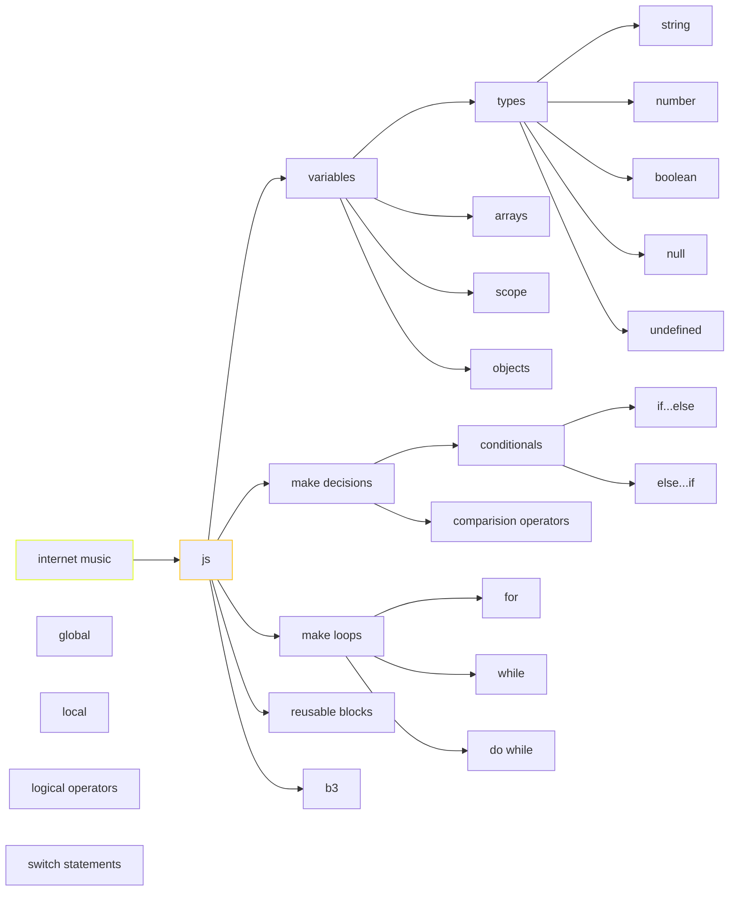

> [!important] > Atención! para correr los snippets de javascript es necesario ir a configuración del plugin Executc de node.js. (ademas de tener instalado node.js) En windows la ruta es C:\Program Files\nodejs\node.exe





## breve intro

La primera aparición pública de Javascript la encontramos en el año 1995 cuando se utiliza como herramienta del navegador Netscape Navigator, con el objetivo de agregar programas a páginas web.

## palabras reservadas
```js
break, case, catch, continue, default, let
delete, do, else, finally, for, function, if, in, instanceof, new, return, switch, this, throw, try, typeof, var, void, while, with
```


## variables
un espacio de memoria asignable mediante un nombre y un valor. Tres aspectos fundamentales de las variable en js son: los tipos (enteros, reales, cadenas de texto, boleanos, null y undefined),  el scope y el uso de variables como objetos. 

```javascript

var a = 10;
var b = 12;
console.log (a + b)

var  f = true;

```
Una variable **let** puede recibir múltiples asignaciones en el transcurso de la aplicación, es decir que puede cambiar de valor varias veces. Una constante **const** recibe una única asignación al momento de su declaración, impidiendo que su valor se modifique luego.

### String
Secuencia de texto en cadena

```js

let miVariable = 'myNote';
```

### Number

Esto es un número. Los números no tienen comillas.

```js
let miVariable = 440;
```


### Boolean

Tienen valor true/false

```js

let miVariable = true;
```

#### operaciones básicas

```js
	let  textoA = "acorde";
    let   textoB = "RE";
    const BLANCO = " ";

    let resultadoA = textoA + textoB; //acordeRE
```

## arrays

Permite almacenar varios valores en una sola referencia.
```javascript
var notas=["C","C#","D","D#", "E","F","G","G#","A","A#","B"]

var total = notas.length;

console.log ("listar toda la escala :", notas, "\n" , 
			'la cantidad de notas es :', total, "\n",
			'la tercera nota es : ', notas[3], "\n", 
			'la posición de la nota F es : ', notas.lastIndexOf('F'), "\n",
			'las tres últimas notas som : ',notas.slice(total-3,total), "\n",
			'la escala retrógrada es : ', notas.reverse(), '\n',

			'la escala contiene un Bb : ', notas.includes('Bb'), "\n",
		    'la escala contiene un G# : ', notas.includes('G#')
)


```

```javascript
var notas=["C","C#","D","E","F","G","A","B"]

console.log ("listar toda la escala", notas)

```

Para llamar a cada valor del array: 
```js
notas[0], notas[1]
```
etc.

## control de flujos

El control de flujos es marcar puntos donde, a partir de alguna evaluación, el devenir del código pueda tomar varios caminos posibles de acción.

Para ello se utilizan los valores **booleanos** (true or false)

### condicionales
```js
if (condición) {
  código a ejecutar si la condición es verdadera
} else {
  ejecuta este otro código si la condición es falsa
}
```
### operadores lógicos
```javascript
'=' //Igual a
!= //Diferente a 
=== //Contenido y tipo igual a 
!== //Contenido o tipo diferente de 
> //Mayor que 
>= //Mayor o igual que 
< //Menor que 
⇐ //Menor o igual que

//operadores lógicos
&& //and
|| //or
! //not
```

```js
let freq = 440; //podría ser modificable mediante otra función, por ejemplo, un valor de un form accediendo al DOM

if (freq < 440) {
    funcion(1);
}

else if (precio < 440) {
    funcion(2);
}

else if (precio = 440) {
    funcion(3);
}

else {
    funcion(4);
}
```
## ciclos
Los ciclos, también bucles o iteraciones son un medio rápido y sencillo para hacer algo repetidamente.

### ciclos por conteo
Repiten un bloque de código un número de veces específica. Estructura **for**. 

```js
for(desde; hasta; actualización) {
 //lo que se escriba acá se ejecutará mientras dure el ciclo
}
```

```js 
for (let i = 0; i < 10; i++) {
    alert(i);
}
```

### ciclos condicionales
Repiten un bloque de código mientras la condición evaluada es verdadera. Estructuras **while** y **do...while**.

```js
while (algo, operador lógico, otro) {
	función();
}
```

```js
let entrada = prompt("Ingresar un dato");
//Repetimos con While hasta que el usuario ingresa "ESC"

while(entrada != "ESC" ){

    alert("El usuario ingresó "+ entrada);

    //Volvemos a solicitar un dato. En la próxima iteración se evalúa si no es ESC.

    entrada = prompt("Ingresar otro dato");
}
```

## switch
Maneja múltiples condiciones sobre la misma variable (técnicamente se podría resolver con un if, pero el uso de switch es más ordenado)

```js
switch(numero) {
 case 5:
   ...
   break;
 case 8:
   ...
   break;
 case 20:
   ...
   break;
 default:
   ...
   break;
} //cada condición se evalúa y, si se cumple, se ejecuta lo que esté indicado dentro de cada case, después de las instrucciones de cada case se incluye la sentencia break para terminar la ejecución del switch
```

## objetos

Son estructuras que podemos definir para agrupar valores bajo un mismo criterio. Es una colección de datos relacionados como una entidad. Se componen de un listado de pares clave-valor, es decir, contienen propiedades y valores agrupados.

## funciones
Conjunto de instrucciones que se agrupan para realizar una tarea concreta

```js
const synth = new Tone.Synth().toDestination();

//declaración
function tone () {
  synth.triggerAttackRelease("C4", "1"); //en segundos
  synth.volume.value = -30;
}

//llamado
tone();
```

### parámetros

Son variables que se declaran dentro de la función, entre sus paréntesis. Los valores de éstos se definen luego en el llamado.

```js
function conParametros(parametro1, parametro2) {
    console.log(parametro1 + " " + parametro2);
}
```

El valor que toman estos parámetros se definen en el **llamado**. 
```js
conParametros("generative", "art"); // → “generative art”
```

### console.log() 
La sentencia console.log() muestra el mensaje que pasemos como parámetro a la llamada en la consola JavaScript del Navegador web.

```js
console.log("el audioCtx está inicializado");

let acorde = “RE”
    console.log(acorde) //RE
```

### funciones anónimas
Se define sin nombre y se utiliza para ser pasada como parámetro o asignada a una variable. En el caso de asignarla a una variable, se puede llamar usando el identificador de la variable declarada.

```js
//Generalmente, las funciones anónimas se asignan a variables declaradas como constantes
const suma  = function (a, b) { return a + b }
const resta = function (a, b) { return a - b }

console.log( suma(15,20) )
console.log( resta(15,5) )
```
### funciones flecha
Funciones anónimas de sintaxis simplificada. Están disponibles desde la versión ES6 de JavaScript, no usan la palabra function pero usa ⇒ (flecha) entre los parámetros y el bloque.

```js
const suma  = (a, b) ⇒ { return a + b }
//Si es una función de una sola línea con retorno podemos evitar escribir el cuerpo.
const resta = (a, b) ⇒  a - b ;
console.log( suma(15,20) )
console.log( resta(20,5) )
```

## scope
Zona del programa en la cual se define, el contexto al que pertenece la misma dentro de un algoritmo, restringiendo su uso y alcance. Puede ser global o local.
```js
let nota = “RE” // variable global

function escala() {
    let nota = “DO” // variable local
    console.log(nota)
}

//Accede a nombre global
console.log(nota)   // RE
  

//Accede a nombre local
escala() // DO
```

## objetos

Son estructuras que podemos definir para agrupar valores bajo un mismo criterio. Es una colección de datos relacionados como una entidad. Se componen de un listado de pares clave-valor, es decir, contienen propiedades y valores agrupados.
```js
let freq = 440;
let dinamica   = "pp";
let instrumento  = "flauta2";

const sonido1 = { freq: 440, dinamica: "pp", instrumento: "flauta" }

//para obtener el valor de una propiedad del objeto
console.log(sonido1.dinamica)
//otra forma
console.log(sonido1["dinamica"])

//para asignar nuevos valores
sonido1["instrumento"] = "piano"
//otra forma
sonido1.freq = 880
```
