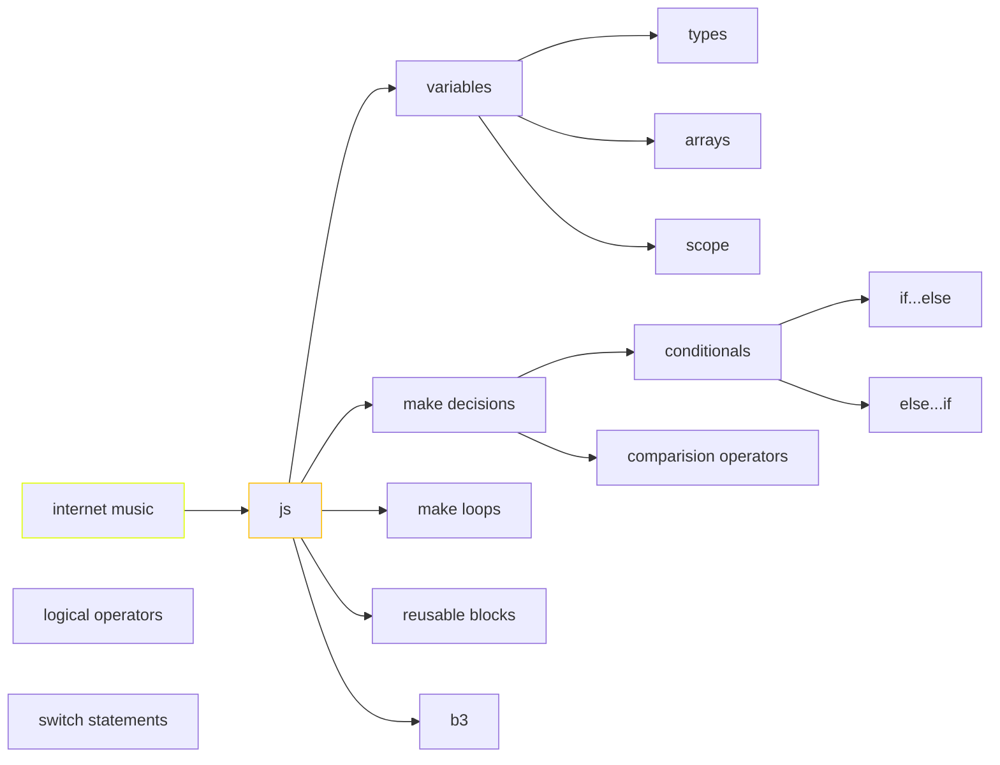

> [!important] > Atención! para correr los snippets de javascript es necesario ir a configuración del plugin Executc de node.js. (ademas de tener instalado node.js) En windows la ruta es C:\Program Files\nodejs\node.exe





# breve intro

La primera aparición pública de Javascript la encontramos en el año 1995 cuando se utiliza como herramienta del navegador Netscape Navigator, con el objetivo de agregar programas a páginas web.

## palabras reservadas
```js
break, case, catch, continue, default, let
delete, do, else, finally, for, function, if, in, instanceof, new, return, switch, this, throw, try, typeof, var, void, while, with
```


## variables
un espacio de memoria asignable mediante un nombre y un valor. Tres aspectos fundamentales de las variable en js son: los tipos (enteros, reales, cadenas de texto, boleanos, null y undefined),  el scope y el uso de variables como objetos. 

```javascript

var a = 10;
var b = 12;
console.log (a + b)

var  f = true;

```
Una variable **let** puede recibir múltiples asignaciones en el transcurso de la aplicación, es decir que puede cambiar de valor varias veces. Una constante **const** recibe una única asignación al momento de su declaración, impidiendo que su valor se modifique luego.

### String
Secuencia de texto en cadena

```js

let miVariable = 'myNote';
```

### Number

Esto es un número. Los números no tienen comillas.

```js
let miVariable = 440;
```


### Boolean

Tienen valor true/false

```js

let miVariable = true;
```

## arrays

Permite almacenar varios valores en una sola referencia.
```javascript
var notas=["C","C#","D","D#", "E","F","G","G#","A","A#","B"]

var total = notas.length;

console.log ("listar toda la escala :", notas, "\n" , 
			'la cantidad de notas es :', total, "\n",
			'la tercera nota es : ', notas[3], "\n", 
			'la posición de la nota F es : ', notas.lastIndexOf('F'), "\n",
			'las tres últimas notas som : ',notas.slice(total-3,total), "\n",
			'la escala retrógrada es : ', notas.reverse(), '\n',

			'la escala contiene un Bb : ', notas.includes('Bb'), "\n",
		    'la escala contiene un G# : ', notas.includes('G#')
)


```

```javascript
var notas=["C","C#","D","E","F","G","A","B"]

console.log ("listar toda la escala", notas)

```

Para llamar a cada valor del array: 
```js
miVariable[0]`, `miVariable[1]
```
etc.
