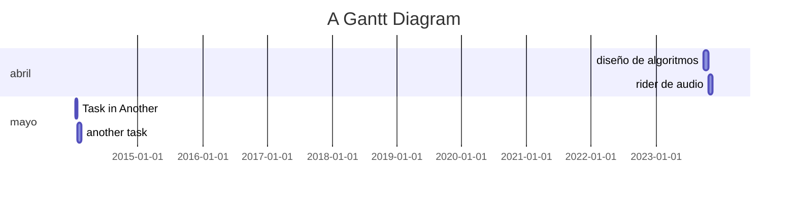
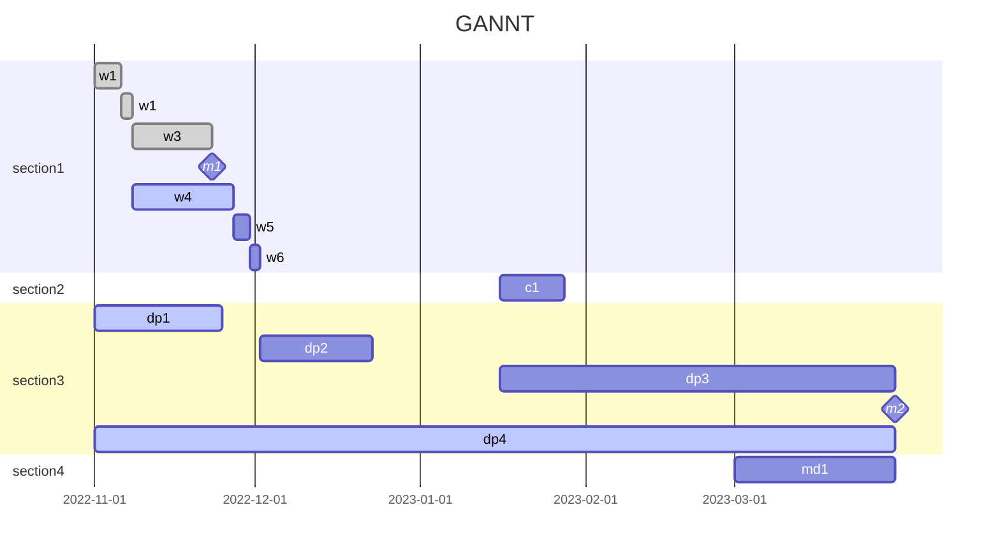

# titulo
- restringe la polisemia.
- es un puente entre la abstracción y el mundo real. 
- clickbait
## subtitulo
- nunca es redundante.
- es un espacio de complicidad entre la creación y la recepción. 
- tiene una condición de verdad pero no garantiza una sola direccionalidad del mensaje. 
- es anti-formal, puede negar o afirmar la forma. 
- tipos: nombre propio ,  somático , procedimiento. 

![[Pasted image 20220906234521.png]]

# síntesis
- está formada por 1 a 3 oraciones. 
# objetivos  
- entre 3 y 5. 
-  marcar un interés principal y otros secundarios. 
# justificación / memoria conceptual
       imaginario especulativo. 
- contexto
- estado del arte [bibliografía comentada]
- paradigma  
- motivación 
# desarrollo
- desglose o explicación de la cosa.
- funcionamiento [horas de apertura, comportamiento del público]
# desarrollo del trabajo.
# cronograma
- etapas  

# materiales
- rider
- planos
- lista de materiales
- presupuesto
	- 
# referencias
- bibliografia