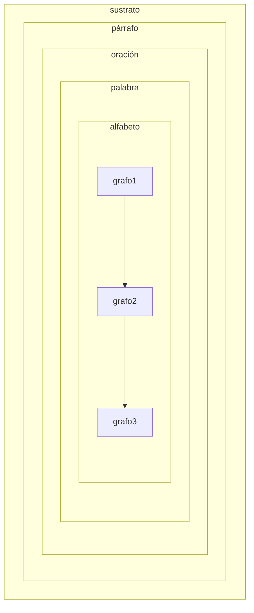
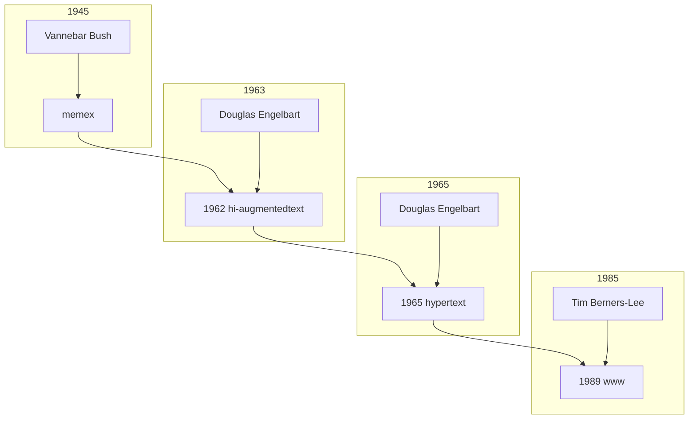

<!-- slide bg="#010100"--> 
![[untref-logo-w.svg|100]]
UNTREF | CYM24
# vida digital
---

# 4 topoi
1. cambios cognitivos
2. semiótica digital: estado de los instrumentos y materiales
3. el código como escritura y lenguaje
4. herramientas 

---
# intro

#internet #escritura #formatos #estilosdigitales #recepción

note: Repasemos algunos hitos de la escritura como fenómeno desde la perspectiva de Internet. Cuáles son los cambios que introdujo, no sólo en los formatos, sino en los estilos, los procesos de pensamiento y la recepción?

---
# lenguaje natural 

1. alfabeto (grafos finitos combinables infinitamente)
2. palabra, (combinaciones de elementos que pertenecen a un alfabeto)
3. oración (combinación de palabras en funciones **gramaticales**)
4. párrafo (combinación de oraciones en significantes **semánticos**)
5. contexto (o sustrato)

#flashcards

note: alfabeto:::para eso repasemos el concepto de lenguaje natural. El punto inicial de todo lenguaje es el alfabeto, un conjunto de grafos (marcas escritas) sin significado específico. Naturaleza atómica. 
Las palabras si ya tienen un significado por fuera del contenido fonético. Es decir que los fonemas construyen en su combinación algo que ellos mismos no poseen. Formando dos conjuntos : los intelegibles, pertenecientes al lenguaje y los no-inteligibles (todo lo que está fuera del lenguaje). Finalmente todo se abarca dentro.

---

---

# lenguaje formal 

---

![[Pasted image 20230829223415.png]]

note: los lenguajes de programación en cambio son lenguajes formales, no emergen de forma natural sino de modo estructurado. Esto es un poco lo que provoca el shock cultural que sentimos cuando empezamos a programar. La forma de hablar con los sistemas exo-humanos es aun formal en el sentido que le damos al lenguaje. Esta es también la revolución del 2017 con los Transformers de ML. Que por primera vez un lenguaje natural llega a la convergencia de los históricos lenguajes formales. Lo ampliaremos al hablar de ML. 
Los lenguajes formales están compuestos por 1. albabeto, sintáxis y semántica. Tenemos símbolos , que son unidades de significado.

---

### alfabeto
paul klee

![[Pasted image 20230829224100.png]]
---

### alfabeto

arnold schoenberg

![[Pasted image 20230829224222.png]]
---
### alfabeto
arnold schoenberg
![[Pasted image 20230829224242.png]]
- [[memex]]
- [[hi augmentation]]
- [[hypertext]]
- [[Augmented Cognition]]

---
### alfabeto
mark andre

![[Pasted image 20230829224353.png]]

---
### alfabeto
helmut lachenmann 
![[Pasted image 20230829224438.png]]
---
### alfabeto

punto, linea y plano. 

---
### alfabeto

```javascript

for (int i = 0; i < 10; i++) {print(i)}

```

---
### sintaxis

1. conjunto de reglas que definen combinaciones de símbolos **permitidos**

---




---
## semántica


Operación que intenta relacionar las palabras del lenguaje con "entes" de significados externos. 

---

### construcción (válida) del lenguaje - significado del "mundo real (del sustrato)

---

pero si tengo una parte del objeto a significar semanticamente que escapa al dominio del sustrato, el objeto rompe el límite del lenguaje y se ubica en un "meta lenguaje"

---
Para resumir internet y la revolución que queremos explicar en una oración  podemos decir que internet ha incrustado repentinamente un cúmulo de alfabetos (emojis, memes, hyperlinks, apis, videos, audios, tags geotags , sensotags, cryptotags, etc) en nuestro lenguaje añejado provocando un revasamiento de la operación semántica donde todo se ha vuelto metalenguaje. 

---

la pregunta es como navegamos en este nuevo medio para organizar el lenguaje, pero también la vida de músicos, o de personas. 

---

## herramientas y categorías

---

### vínculo bidireccional

(Bush, 1945) memex machine, the total document organized by indexes.

![[Pasted image 20230829225649.png]]

note:el vínculo bi-direccional tiene una conciencia social - en el sentido de otras páginas o nodos que apuntan hacia el vínculo - Es decir que comparamos un conocimiento con un contexto de conversación de dos sentidos entre nuestros conectores de red.

---

Vannevar Bush, 1945

- el asunto de la selección: como recuperar información.
- la catalogación: en este sentido es necesario saber como funciona la mente, y es basicamente por **asociación. Sujetar un hecho o idea.** Por lo cual cualquier sistema de recuperación deberá funcionar de la misma manera, por asociación.
- Lo opuesto a la asociación es el índice.

---

- La asociación física de la asociación es el shortcut (teclas de acceso rápido) .
- En 2014, [Darpa](https://web.archive.org/web/20150610162436/http://opencatalog.darpa.mil/MEMEX.html) [la agencia militar estadounidense creadora de Internet] lanza el proyecto Memex, un motor de búsqueda que incluya la deepweb (la web no indexada) mas allá de google con el çulumo de vectores intervenidos en la creación de información actual:
    - descubrimiento de contenidos
    - extracción de información
    - recuperación de información
    - colaboratividad de usuarios
    - extensión de busqueda a la deepweb, darkweb, y no tradicionales (multimedia).

---

note:Vannevar Bush en ( As we may think, 1945) imaginó una máquina llamada Memex (acrónimo de Memory Index) , un dispositivo de base de datos en el que se almacenaria todo documento. Su teología es encontrar una solución a la densidad información de principio de siglo XX brindando una herramienta de recuperación de información. Intenta resolver dos instancias:

---

ejemplos en obisidian

---

### patrones de lenguaje

- topografía sobre la línea de tiempo (la información está conectada a otra a través de temas relacionados (enlaces bidireccionales, breadcrumb), temas (etiquetas) y contexto compartido (carpetas).
    - El etiquetado también es una ciencia de Internet:
        - preferencia de las ontologías asociativas (etiquetas emergentes) a las taxonomías jerárquicas.

---

### crecimiento continuo

- un objeto cultural ya no es una pieza estática, sino un espacio temático en crecimiento con posibilidad de edición, performatibilidad, colaboración y seguimiento de versiones.
- idea a lógica difusa a patrón de pensamiento a reconocimiento de patrones → epistemología compartible → exorganología → música en red.
- cultura del like-comment → imperfección → aprendizaje en público.

---
![[Pasted image 20230829230008.png]]

---

[[Gwern Branwen]] pioneros de los jardines digitales gwern.net

- estilo de redacción  
- lectura estructural:  
- niveles estructurales de alto a bajo: título, bloque de metadatos, resúmenes, encabezados de sección, notas al margen, palabras clave enfatizadas en elementos de lista, notas a pie de página/sizenotes, secciones colapsadas, referencias cruzadas internas (o emergentes)  
- tamaño de texto limitado y visualización del tiempo de lectura.  
- estructura de árbol y notas al margen.  
- exposición progresiva (plegado de código)  

---
note:todos ellos tienen también enlaces a una nueva ciencia del artículo científico, representación en látex sin js, comentarios en disqus, gestores de referencias (mendeley, zotero, paperbox) y link-ificación automática.

---
![[Pasted image 20230829230127.png]]

---
Gestores de notas , referencias, vida etc.

---

### zettelkasten (caja deslizante)

Niklas Luhman

![[Pasted image 20230829230243.png]]

---
<iframe title="Einblicke in das System der Zettel - Geheimnis um Niklas Luhmanns Zettelkasten" src="https://www.youtube.com/embed/4veq2i3teVk?feature=oembed" height="113" width="200" allowfullscreen="" allow="fullscreen" style="aspect-ratio: 1.76991 / 1; width: 100%; height: 100%;"></iframe>
---

# sumario de herramientas e ideas 

[[a-dataview]] 
guido 
exalidraw 
mermaid
mnemonis medium
space repetition
project-based subject
executable books
dynamic music scores
new papers

