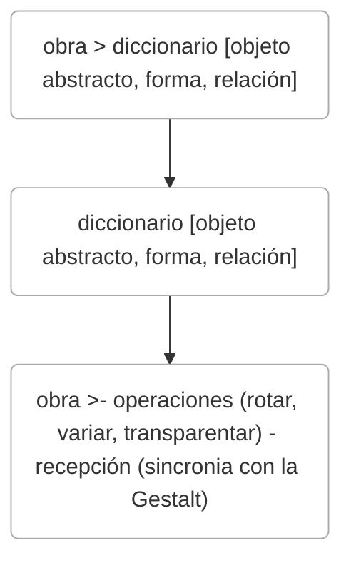

<!-- slide bg="#010100"--> 
![[untref-logo-w.svg|100]]
CYM24

# cohesión audiovisual
---

# intro
una partitura es muy parecida a un código. no hay sonido , pero si una serie de instrucciones para crearlo. Luego estas instrucciones son compiladas por personas. 

---
## reproducción técnica

- 1920 → reproducción técnica del audio
- es un registro técnico otra forma de escritura?
- nuevas escrituras y memorias: sampler, scratch, vst espectrales, síntesis concatenativa. 
- note: Lo que sucedió desde -1920 es que aparece un nuevo tipo de registro, la reproducción técnica del audio, que en la próxima generación comenzaría a transformase en un tipo de memoria y un tipo de escritura. La pregunta es, es un .wav o un .mp3 una representación del acto musical o es un acto en si mismo?, hay una música del daw y otra música del espacio real?,  o bien, puede un registro transformarse en una partitura o en un instrumento? El sampler es el primer instrumento que toca con registros, el siguiente podria ser la síntesis concatenativa. Y también un registro intermedio lo ocupan los procesos. Un delay cuya memoria es lo suficientemente desarrollada da lugar a un looper, lo mismo puede suceder con una reverb espectral selectiva que recomponga fragmentos segun ciertos algorítmos de selección. A nivel social, los grandes repositorios de sonidos, instrumentos virtuales ,vst también generan desde soportes para diversas músicas como músicas en si misma, como el black midi music, el plunderphonics, el mash-up.

--

## la abstracción
la partitura es el espacio donde puede manejarse la abstracción en música. El concepto mismo de abstracción es bastante algorítmico. Se trata de dotar a una cosa de atributos aislados, parametrizables para poder re-utilizarlos. 
Puntualmente en la historia del arte, la abstracción aparece en el momento donde dicho arte prescinde de su función mimética. Queda solamente concentrado en la forma y sus elementos , el color, la línea. 

--
### relación espectador-oyente-obra 

la abstracción propone un vínculo entre obra y oyente del tipo dialéctico. no hay semántica, el diccionario es organizado por un ratio , proporción y relación. Si por el lado de la creación hay una analogía con el método científico, del lado de la recepción se comienza a percibir la importancia de la Gestalt, es decri un tipo de comunicación subyacente que apela a la naturaleza misma de la percepción .

--




--
## pioneros del arte generativo .

Pueden citarse algunos emergentes incompletos, por el lado de los grupos artístcos los predecesores [[Futurismo]], [[Die Blaue Reute]],  [[Suprematismo]]. 
En Yugoslavia el [[new Tendencies]] y el francés  [[GRAV]] (el grupo de investigación en artes visuales). Del cual emerge [[Vera Molnár]]

---

<iframe width="900" height="529" src="https://www.youtube.com/embed/9ctg_cVYKuQ" title="Vera Molnar exhibition" frameborder="0" allow="accelerometer; autoplay; clipboard-write; encrypted-media; gyroscope; picture-in-picture" allowfullscreen></iframe>

---

<iframe src="https://editor.p5js.org/CastaZ/sketches/1Wfe5-nXJ" allow="fullscreen" allowfullscreen="" style="height:100%;width:100%; aspect-ratio: 16 / 9; "></iframe>
---

<iframe src="https://editor.p5js.org/kjhollen/sketches/BJeN4eTPe" allow="fullscreen" allowfullscreen="" style="height:100%;width:100%; aspect-ratio: 16 / 9; "></iframe>

---
Molnár usa Fortran (el mismo lenguaje que Max Matheew en Music-n ) para interpretar relaciones matemáticas que luego imprimia sobre papel.  

---
En el concepto seriado devenido del grabado, Molnár comienza a guardar versiones de la generatividad del cálculo , y esto le permite generar una distancia entre el acervo y su propia persona como creadora. 

---
Esta noción del abandono o mediación de la voluntad es esencial para seguir un devenir histórico entre el impacto de las herramientas numéricas y la transformación de la noción del sujeto e individuo.

---

<iframe src="https://cagrimmett.com/tutorial/2022/03/08/how-to-create-vera-molnars-structure-de-quadrilateres-in-p5-js/" allow="fullscreen" allowfullscreen="" style="height:100%;width:100%; aspect-ratio: 16 / 9; "></iframe>

---
## estructura del arte generativo 

1. código
2. animación o scheduling 
3. interacción [reactividad, transitividad, transparencia, interactividad, complejidad]
4. recursivad e iteración(feedback, algorítmos genéticos, evaluación, ml

---
Iannis Xenakis, Pithoprakta, 1955-56

<iframe title="Iannis Xenakis: Pithoprakta (1955/1956)" src="https://www.youtube.com/embed/AE1M2iwjTsM?feature=oembed" height="150" width="200" allowfullscreen="" allow="fullscreen" style="aspect-ratio: 1.33333 / 1; width: 100%; height: 100%;"></iframe>

note:Pithoprakta (1955-56) es una obra de Iannis Xenakis para dos trombones, 46 instrumentos de cuerda, xilófono y bloque de madera, estrenada por el director Hermann Scherchen en Múnich en marzo de 1957.  

---
El título se traduce como "acciones a través de la probabilidad". En el caso de "Pithoprakta", esto se relaciona con la ley de los grandes números de Jacque Bernoulli, que afirma que, a medida que aumenta el número de ocurrencias de un suceso fortuito, el resultado medio se aproxima más a un fin determinado. 

---
La obra se basa en la mecánica estadística de los gases, la ley de Gauss o el movimiento browniano. Cada instrumento se concibe como una molécula que obedece a la ley de distribución de Maxwell-Boltzmann, con una distribución gaussiana de la fluctuación de la temperatura.  

---
note:Del mismo modo, al mirar una composición hecha en la Técnica de los Doce Tonos, es más fácil identificar y verificar el original, el retrógrado, la inversión, etc., en la partitura que escuchar esas cosas en la realización.

<iframe title="Zwölftonwerbung - Twelve tone commercial" src="https://www.youtube.com/embed/LACCAF04wSs?feature=oembed" height="150" width="200" allowfullscreen="" allow="fullscreen" style="aspect-ratio: 1.33333 / 1; width: 100%; height: 100%;"></iframe>

---

<iframe title="Schoenberg: Suite for Piano, Op.25 (Boffard)" src="https://www.youtube.com/embed/bQHR_Z8XVvI?feature=oembed" height="113" width="200" allowfullscreen="" allow="fullscreen" style="aspect-ratio: 1.76991 / 1; width: 100%; height: 100%;"></iframe>

--

Braxton describe el #108B como "una serie de posibles sonidos de líneas curvas o cambios dinámicos de líneas curvas" (311), lo que implica que las líneas pueden indicar el tono y/o el volumen, y compara la música primero con "un continuo de tensiones y 'susurros'
> Graham Lock. Lo que yo llamo un sonido
--

## partituras de acción 

Destilado aún más, la partitura es sólo un conjunto de instrucciones. Podrían estar escritas en cualquier idioma sencillo.


![[yokoono.jpeg]]

---
[Ligeti - Artikulation]

<iframe title="Ligeti - Artikulation" src="https://www.youtube.com/embed/71hNl_skTZQ?feature=oembed" height="150" width="200" allowfullscreen="" allow="fullscreen" style="aspect-ratio: 1.33333 / 1; width: 100%; height: 100%;"></iframe>
--

Synchromy - Norm McLaren
<iframe title="Synchromy -  Norman McLaren" src="https://www.youtube.com/embed/UmSzc8mBJCM?feature=oembed" height="150" width="200" allowfullscreen="" allow="fullscreen" style="aspect-ratio: 1.33333 / 1; width: 100%; height: 100%;"></iframe>

--

Dots - Norm McLaren
<iframe title="Norman McLaren - Dots (1940)" src="https://www.youtube.com/embed/E3-vsKwQ0Cg?feature=oembed" height="150" width="200" allowfullscreen="" allow="fullscreen" style="aspect-ratio: 1.33333 / 1; width: 100%; height: 100%;"></iframe>

--

[Matrix III - John Whitney](https://www.youtube.com/watch?v=ZrKgyY5aDvA)

--


# claridad conceptual y cohesión con música interactiva

--

[BubbleHarp](https://www.youtube.com/watch?v=ly8tgaswRo8)

--
[OscilloScoop - Scott Snibbe Studio](https://www.youtube.com/watch?v=ymW-_RENMKY)

--

[Thicket - Morgan Packard & Josh Ott](https://www.youtube.com/watch?v=4Xr9ELZSOnc)

-- 
## cohesión espacial

[National Mall - BlueBrain](https://vimeo.com/25374903)


---

# código como partitura

--
## Max Matthew , Music N

<iframe src="https://m5live.zztt.org" allow="fullscreen" allowfullscreen="" style="height:100%;width:100%; aspect-ratio: 16 / 9; "></iframe>


-- 
## CSOUND
http://www.csounds.com/manual/html/ScoreTop.html

---


# js2

ejemplo. de la clase pasada

<iframe src="https://codepen.io/LucianoAzzigotti/pen/abYRgBv" allow="fullscreen" allowfullscreen="" style="height:100%;width:100%; aspect-ratio: 16 / 9; "></iframe>
# scheduling

<iframe src="https://codepen.io/LucianoAzzigotti/pen/wvPvrrO" allow="fullscreen" allowfullscreen="" style="height:100%;width:100%; aspect-ratio: 16 / 9; "></iframe>

### **Transport**

[Tone.Transport](https://tonejs.github.io/docs/Transport) a diferencia del AudioContext puede ser comenzado, parado, loopeado, ajustado etc en el momento.

[Tone.Loop](https://tonejs.github.io/docs/Loop) es un loop.

```js

// crea dos sintes mono 
const synthA = new Tone.FMSynth().toDestination(); 
const synthB = new Tone.AMSynth().toDestination(); 

const loopA = new Tone.Loop(time => { synthA.triggerAttackRelease("C2", "8n", time); }, "4n").start(0); const loopB = new Tone.Loop(time => { synthB.triggerAttackRelease("C4", "8n", time); }, "4n").start("8n"); //empieza luego del sinthA 

Tone.Transport.start()

```


<iframe src="https://codepen.io/LucianoAzzigotti/pen/vYWYOzV" allow="fullscreen" allowfullscreen="" style="height:100%;width:100%; aspect-ratio: 16 / 9; "></iframe>


<iframe src="https://codepen.io/LucianoAzzigotti/pen/abYRgBv?editors=1010" allow="fullscreen" allowfullscreen="" style="height:100%;width:100%; aspect-ratio: 16 / 9; "></iframe>


## señales 

Las señales son como los AudioParams en el sentido de que puedes utilizarlas para cambiar los valores como una perilla. También te permiten programar eventos automatizados y cambiar suavemente los valores.


```js
var osc = new Tone.Oscillator("C4", "square").toMaster().start(0).stop(3);

osc.frequency.exponentialRampToValue("C1", 2);

```


