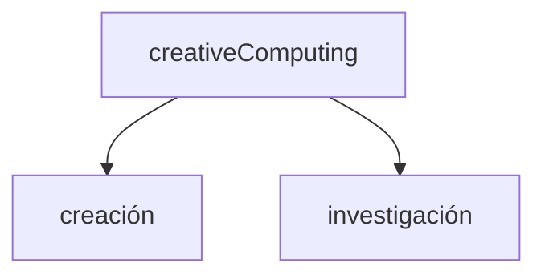

<!-- slide bg="#010100" -->
UNTREF | CYM23 | 07

# human-book-computer

<iframe width="560" height="315" src="https://www.youtube.com/embed/fDtU2dVrBeA?si=l5a5VVC4C3UnH4th" title="YouTube video player" frameborder="0" allow="accelerometer; autoplay; clipboard-write; encrypted-media; gyroscope; picture-in-picture; web-share" allowfullscreen></iframe>

Nick Montfort (poeta, artista y profesor de digital Media) trabaja en diversos proyectos artísticos incluyendo Web, publicación de libros y lectura literaria, exposiciones en galerías y live-coding.
Centrado en la poesía digital y en la generatividad Montfort analiza como ésta desafía y redefine no sólo el concepto de autoría, sino también los medios de publicación y presentación posdigital en diversos contextos y formatos.

*"Exploratory Programming for the Arts and Humanities"* muestra a la computación e informática dentro de la cultura (no como algo periférico), en relación a procesos de distintos proyectos artísticos. El autor toma a este libro como un sistema *human-book-computer*; una herramienta a-la-mano.

### Exploración vs/y explotación


Exploración como punto de partida en lo cotidiano, no sólo en lo artístico - informático, pudiendo aplicar los fundamentos de la programación:

- noción de sistema
- abstracción
- cálculos
- utilización de datos

### Prose - Charles Hartman


### the Scandroid
<iframe width="560" height="315" src="http://charlesohartman.com/verse/metrics/tutorials/interactive.php" title="YouTube video player" frameborder="0" allow="accelerometer; autoplay; clipboard-write; encrypted-media; gyroscope; picture-in-picture; web-share" allowfullscreen></iframe>


# Código

## control de flujos

### condicionales
```js
if (condición) {
  código a ejecutar si la condición es verdadera
} else {
  ejecuta este otro código si la condición es falsa
}
```
### operadores de comparación
```js
= //Igual a
!= //Diferente a 
=== //Contenido y tipo igual a 
!== //Contenido o tipo diferente de 
> //Mayor que 
>= //Mayor o igual que 
< //Menor que 
⇐ //Menor o igual que

//operadores lógicos
&& //and
|| //or
! //not
```
## ciclos
Los ciclos, también bucles o iteraciones son un medio rápido y sencillo para hacer algo repetidamente.

### CICLOS POR CONTEO
Repiten un bloque de código un número de veces específica. Estructura **for**. 

```js
for(desde; hasta; actualización) {
 //lo que se escriba acá se ejecutará mientras dure el ciclo
}
```

```js 
for (let i = 0; i < 10; i++) {
    alert(i);
}
```

### CICLOS CONDICIONALES
Repiten un bloque de código mientras la condición evaluada es verdadera. Estructuras **while** y **do...while**.

```js
while (algo, operador lógico, otro) {
	función();
}
```

```js
let entrada = prompt("Ingresar un dato");
//Repetimos con While hasta que el usuario ingresa "ESC"

while(entrada != "ESC" ){

    alert("El usuario ingresó "+ entrada);

    //Volvemos a solicitar un dato. En la próxima iteración se evalúa si no es ESC.

    entrada = prompt("Ingresar otro dato");
}
```


## Bibliografía

MONTFORT, N. (2016). _Exploratory Programming for the Arts and Humanities._ MIT Press

MONTFORT, N. (2017). _The future_. MIT Press

Connected Code: Why Children Need to Learn Programming de Yasmin B. Kafai y Quinn Burke