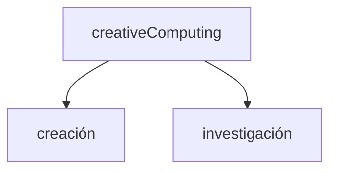

<!-- slide bg="#010100" -->
UNTREF | CYM23 | 07

# human-book-computer

<iframe width="560" height="315" src="https://www.youtube.com/embed/fDtU2dVrBeA?si=l5a5VVC4C3UnH4th" title="YouTube video player" frameborder="0" allow="accelerometer; autoplay; clipboard-write; encrypted-media; gyroscope; picture-in-picture; web-share" allowfullscreen></iframe>

Nick Montfort (poeta, artista y profesor de digital Media) trabaja en diversos proyectos artísticos incluyendo Web, publicación de libros y lectura literaria, exposiciones en galerías y live-coding.
Centrado en la poesía digital y en la generatividad Montfort analiza como ésta desafía y redefine no sólo el concepto de autoría, sino también los medios de publicación y presentación posdigital en diversos contextos y formatos.

*"Exploratory Programming for the Arts and Humanities"* muestra a la computación e informática dentro de la cultura (no como algo periférico), en relación a procesos de distintos proyectos artísticos. El autor toma a este libro como un sistema *human-book-computer*; una herramienta a-la-mano.
### Exploración vs/y explotación

Exploración como punto de partida en lo cotidiano, no sólo en lo artístico - informático, pudiendo aplicar los fundamentos de la programación:

- noción de sistema
- abstracción
- cálculos
- utilización de datos