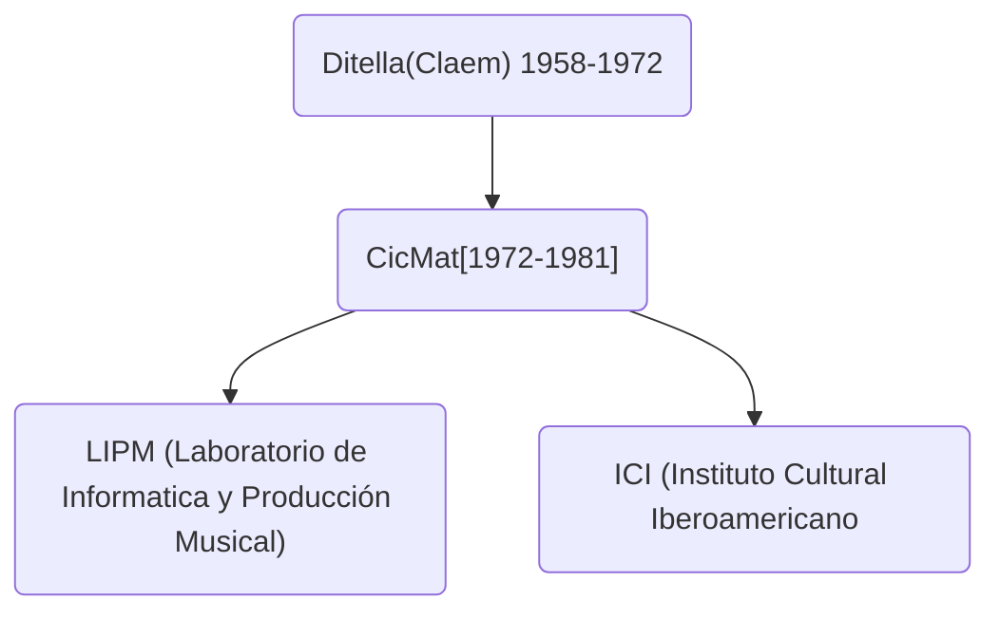

---
type: class
tags: cym, arte numérico
unit: 0
num:  13
year : 2023

---

<!-- slide bg="#010100"--> 
![[untref-logo-w.svg|100]]
CYM24

# Proto-historia del arte numérico argentino

---

# Prolegomenos

Arte Madi  
Xul Solar 
Gyula Kosice
Arte Cinético -> Arte Abstracto - Geométrico [MACMA]
Op-art  
Ludicismo 

# Curadores desde los '80 a la actualidad
Graciela Taquini
Carlos Trilnik
Rodrigo Alonso
Jazmin Adler 

# Música 

## Eduardo Kusnir 
### La panaderia (1970)

Catalina (Conversor analógico digital - Fernando Von Reichenbach - 1967)

Tesis de doctorado Paris VIII

Marta Minujin - Simultaneidad en simultaneidad.

Roberto Jacoby  
Un arte de los medios de comunicación [manifiesto] (1966)
Arte social como experiencia

Tucuman Arde!

Roberto Jacoby Proyecto Venus [2004]
						Belleza y Felicidad [Fernanda Laguna ]
							Eloisa Cartonera
							Diego Bianchi
								Mansalva
								Caja nEgra
								

### net-art argentino

Gustavo Romano 

Ciro Museres

Gabriel Chaile 
((( Alejandro Jodorowski El topo, La montaña sagrada  )))

# net-art

1991 -  internet se transforma en una plataforma ubicua en el ámbito univesitario

1994 - explosión comercial 

1995-2000 internet 1.0  
	del sitio único a los usuarios 
	hyperlink
	MIT - author for one day 
	wikipedia

Era de la afectivización <- 
   individuo deviene un igual con la institución 
   

2002-2010  internet 2.0 
    de los usuarios a los usuarios. 
	    social networking, youtube, facebook.
