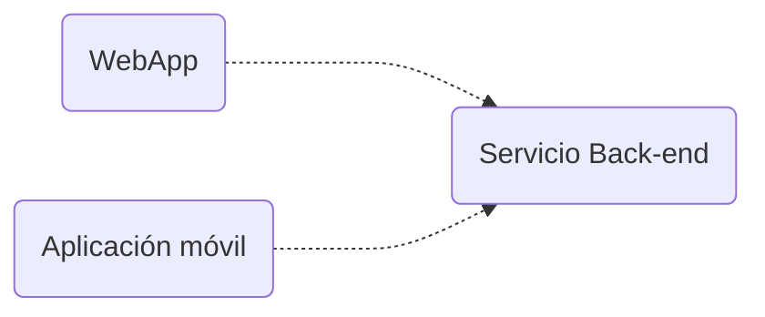

<!-- slide bg="#010100"--> 
![[untref-logo-w.svg|100]]
CYM24
# un instrumento online colectivo

---

# introducción 


---

## música en red
note: 
- Desde hace unas décadas, la música en red puede considerarse un conjunto de acciones musicales innovadoras facilitadas por la tecnología. 
- Una performance musical en red se produce cuando un grupo de músicos, situados en diferentes lugares físicos, interactúan a través de una red para actuar como si estuvieran situados en la misma sala (Lazzaro J & Wawzynel J ,2001) .

- Sobre esta definición histórica, existe un sesgo que considera la red como un sustituto de la propagación natural del sonido y la luz.  
- Entonces, para establecer ciertas tipologías, podemos llegar a una definición más amplia como:  
	- la práctica de realizar una interacción musical en tiempo real a través de una red informática.  
	- En una interrelación muy estrecha, las limitaciones tecnológicas se convierten en recursos estéticos. Por ejemplo, el abanico de tiempos que establecen las redes LAN o WAN, desde lo estrechamente sincronizado hasta lo vagamente sincronizado, puede compararse con las implicaciones armónicas y de articulación entre un arpegio y un acorde.  
	- Esto es inherente a la evolución de los lenguajes de programación de flujos dedicados a la música. En el caso de MaxMSP, donde el control MIDI (1987), una información en el rango RIA (Realistic Interaction Approach) precede al MSP (Max Signal Processing, 1990-1997), normalmente una señal en el rango LAA (Latency Accepting Approach). En otras palabras, la latencia se convierte en un parámetro musical.  

---
> [!tip] Probá esto. 
> 	1.abrí el terminal  escriba traceroute 192.205.33.93 o cualquier dirección web (sin http :// o https://)
> 	2.traceroute es un comando que permite trazar los saltos entre tu ordenador y un destino final.
> 	3.Cada línea muestra el número de salto, tres medidas para el tiempo de ida y vuelta (RTT), el nombre del sistema y la dirección IP alcanzada en ese salto.  
---
### Tiempo de ida y vuelta (RTT)


note: El tiempo que tarda un paquete en llegar a un salto y volver, mostrado en milisegundos (ms). Por defecto, tracert envía tres paquetes a cada salto, por lo que la salida muestra tres tiempos de ida y vuelta por salto. El RTT también se denomina a veces latencia. Un factor importante que puede afectar al RTT es la distancia física entre los saltos.  
  
Si aparece un asterisco (*) para el RTT, significa que un paquete no fue devuelto dentro del tiempo esperado.  

(para saber mas [aquí](https://hpbn.co/))

---
## que es un exo-instrumento?

note: Es un concepto devenido de la teoría sobre Epitemeo de Bernard Stiegler. En ella Stiegler alude a una relación entre la técnica y la vida de los humanos como algo que se sabe antes de nacer, o en un mundo ideal  y que se recuerda (o aprende) mientras dura la vida. Así la técnica pasa a ser una extensión somática de las necesidades del cuerpo. Dentro de la técnica se incluyen los instrumentos de medición científica, las armas de guerra, las herramientas y también los instrumentos musicales. Un exo-instrumento es aquel que permite que este transpaso somático entre el cuerpo y el instrumento trascienda la cognición del emisor (el cuerpo ) y sea compartida con el instrumento. Mas aún, que ese instrumento musical, diseñado para generar un tipo de intercambio informativo en la situación de concieto, es decir entre los demás performers y el público, también pueda incorporarlos en su disposición material. 

Todas ideas especulativas aparecen lentamente en allgunas experiencias e instrumentos del arte sonoro y la composición de la tradición escrita. 

---
## algunos ejemplos


note: El programador petet creó este valence-aleator, no es exactamente un ejemplo, pero si puede aportar en cuanto al tipo de interface minimalista, y la utilización de simulación física para la introducción y relación de assests (positrones electrones, anillos).

---
<iframe src="https://petet.itch.io/valence-aleator" allow="fullscreen" allowfullscreen="" style="height:100%;width:100%; aspect-ratio: 16 / 9; "></iframe>
---
Por ejemplo en el Gravitaphon de Christian Grammel se propone un objeto no posible de manipular por una persona, que contiene mecanismos misteriosos dentro reaccionando a diferentes ángulos y momentos.

---
<iframe title="Gravitaphon" height="240" width="426" src="https://player.vimeo.com/video/536362703?h=faed38eed0&amp;app_id=122963" allowfullscreen="" allow="fullscreen" style="aspect-ratio: 1.775 / 1; width: 100%; height: 100%;"></iframe>

o en "real-time ist getting realer all the time" de icholas Mortimer y Kevin Rittberger los performers reaccionan ante un exo-instrumento (llamado ICO-bass) hecho de tierra, cuerdas, vinchas electromagnéticas y un desbalance que modifica todos los parámetros. El instrumento es totalmente manipulado colectivamente.  

<iframe title="real-time ist getting realer all the time // Nicholas Mortimer &amp;amp; Kevin Rittberger // Hoxton Arches Gallery London 2016" height="360" width="640" src="https://player.vimeo.com/video/168020099?h=e4e67132f9&amp;app_id=122963" allowfullscreen="" allow="fullscreen" style="aspect-ratio: 1.77778 / 1; width: 100%; height: 100%;"></iframe>

---
# objetivos

- kiss [keep it simple stupid]
- screenless
- musical
	- adsr  e intensidad controlable
	- modulación tímbrica
- objetivos de mínima
	- interface en red. 
- objetivos de máxima
	- networking performance
---


---
hay un destination o varios?
  1 solo. 

? como se definen los generadores 
	tipos [ var generadores = [{tipo: 1, tonejscommand : "Tone.FMsynth", formaOnda: "sin"}]

Mousetrap ("qwer", generadores[1])

Mousetrap ("sq", generadores[1].formaOnda: "square")
como se disparan los generadores

-> pantalla bienvenida ingresando nombre interactor. 
-> hacer un circulo 

---
## estructura de la web 

<iframe src="https://www.researchgate.net/publication/322414342/figure/fig4/AS:581787966296065@1515720468750/Web-server-front-end-A-Schematic-architecture-of-the-server-back-and-front-end-B.png" allow="fullscreen" allowfullscreen="" style="height:100%;width:100%; aspect-ratio: 16 / 9; "></iframe>
Internet funciona por un lado con el código procesado por el navegador, llamado front-end, del lado local del usuario, y por otra parte por la información procesada por el servidor , cuyo desarrollo se llama back-end. 

Cuando programamos en js estamos utilizando el front-end, pero cuando hacemos un fetch o una llamada a APIs remotas, intercambiamos información con los servidores es decir el back end. 

Los scripts y lenguajes  del front-end son html, css, javascript, parte de php, y los del back-end php, procesando los servidores apache y nginx, mysql , c++ y también python. 

En el año 2009 Ryan Dahl , luego de 30 años introducido el entorno Javasreipt, ideó  un entorno de back-end basado en js. 
Para entenderlo rapidamente node.js es como un navegador sin pantalla que toma y responde a comandos desde el prompt (linea de comandos). No es exactamente lo mismo , también existen los headless chromium y headless firefox, pero lo que permite node.js es escribir comandos js del lado del servidor que producen páginas dinámicas antes de que la información se envíe al browser. 

## node.js

- Node.js es un tiempo de ejecución de JavaScript construido sobre el motor V8 de JavaScript de Chrome.  
- Su código JavaScript se ejecuta fuera del navegador.  
- Por lo general, se utiliza para construir de nuevo API (o interfaces de programación de aplicaciones),  
- estas interfaces suelen mantener las aplicaciones frontales como aplicaciones web, aplicaciones móviles, navegador, etc.  
  




- A diferencia de Angular, Next o Django, Node.js es fácil de empezar y es ideal para la creación de prototipos y el desarrollo.  
- Node.js permite utilizar JS en el back-end.  
- Por último, tiene el mayor ecosistema de librerías de código abierto  
  
Antes de node, se necesitaba un lenguaje para escribir aplicaciones frontales (navegador) y otro para el backend (servidores) como perl, php.  
  
Así que, en 2009 Ryan Dahl tuvo la idea de ejecutar JS fuera del navegador, tomando el motor fuera de un browers y poniendo en un programa normal de C++. Este programa se llama **Node**  
  
Pero también tiene ciertos objetos que proporcionan un entorno para el código JS.   
  
Como este entorno es diferente de los que hay en los navegadores, también se llaman de una forma distinta:  
  
```java  
"js" "node.js"  
  
document.getElementById(' '); --> fs.readFile() / http.createServer()  
  
```  


# Proyecto colectivo: un exo-instrumento online

Entre las muchas tareas que requiere construir un exo-insturmento, está la de configurar el protocolo de red. Para eso vamos a usar la API webrtc, y la libreria socket.io que estan basadas en node.js. 

Es decir que para utilizarlas debemos configurar un servidor , no es suficiente ya solo programar una página html  como index.html  

repl.it y otros "cloud IDEs" permiten simular un servidor y programar sin problema un nodo. 

~~Por recomendación de Caro , ya que le gusta glitch vamos a usar esa plataforma para desarrollar, pero eventualmente a medida que el proyecto crezca debería tener su propio github con versiones de archivos locales. (glitch dió varios problemas)~~ 

Por muchas otras razones también decidimos usar react-express que facilita muchas tareas del navegador aunque tenga una curva de aprendizaje.

proyecto:
https://replit.com/@jsmusic/audio-chat-streaming#index.js
## Intro a react

<iframe title="4.2 How to Create Projects on Glitch - Fun with WebSockets!" src="https://www.youtube.com/embed/BFN_h5bK_oc?feature=oembed" height="113" width="200" allowfullscreen="" allow="fullscreen" style="aspect-ratio: 1.76991 / 1; width: 100%; height: 100%;"></iframe>

<iframe title="Aprende React en 15 Minutos 📘" src="https://www.youtube.com/embed/wGxDfSWC4Ww?feature=oembed" height="113" width="200" allowfullscreen="" allow="fullscreen" style="aspect-ratio: 1.76991 / 1; width: 100%; height: 100%;"></iframe>


# screenless basics

## teclado

<iframe height="600" width="800" src="https://replit.com/@jsmusic/generators05-simple?embed=true#index.html" allowfullscreen="" allow="fullscreen" style="aspect-ratio: 1.33333 / 1; width: 100%; height: 100%;"></iframe>


## mouse

### Mousetrap

Mousetrap es una librería que utiliza shortcuts del teclado con JavaScript.


```java
//single keys
Mousetrap.bind("s", function(e) {        //haz lo que quieras  
});
```

<iframe height="600" width="800" src="https://codepen.io/carodip/pen/poVEJxB?editors=0110" allow="fullscreen" allowfullscreen="" style="height:100%;width:100%; aspect-ratio: 16 / 9; "></iframe>

---

```java
//combinations
Mousetrap.bind("command+k", function(e) {        //haz lo que quieras  
```

<iframe height="600" width="800" src="https://codepen.io/carodip/pen/GRdjErX" allow="fullscreen" allowfullscreen="" style="height:100%;width:100%; aspect-ratio: 16 / 9; "></iframe>

---

<iframe height="600" width="800" src="https://codepen.io/carodip/pen/xxjEPJX" allow="fullscreen" allowfullscreen="" style="height:100%;width:100%; aspect-ratio: 16 / 9; "></iframe>

---
#### mouseTrap - grid

<iframe height="600" width="800" src="https://codepen.io/carodip/pen/LYmRQWV" allow="fullscreen" allowfullscreen="" style="height:100%;width:100%; aspect-ratio: 16 / 9; "></iframe>

