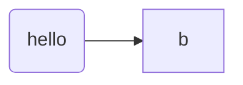

<!-- slide bg="#010100" -->
UNTREF | CYM22
# arte y ciencia
## estado de la cuestión
---

# espectactivas
--
 la clase de cym es **modular**. No es una clase expositiva unicamente, sino que se trazan mapas , módulos y referencias por donde construir un proyecto pero también un contexto. 
 
--
 Hay que ser **generosx**! es muy importante la participación , para lo cual vamos a usar ***discord***. Allí podrán compartir sus proyectos, pero también es muy importante comentar los posteos de lxs compañerxs (elogiar, criticar, compartir referencias o ideas)

---
# objetivos
--
- pensar y crear el futuro de la música.
note: esto es una nota
--
- crear proyectos musicales significativos.
--
- diseñar patrones metacognitivos y metamusicales a la acción musical
--
- comprender las bases del pensamiento científico y su relación con la creación artística.

---
# la  técnica

note: this is presenter note

---
# relaciones 

## tecnologías como herramientas

---
## tecnologías como creadoras de espacios

---
## tecnologías como exo-cerebros

footnote [^1]
<!-- element class="red" -->
