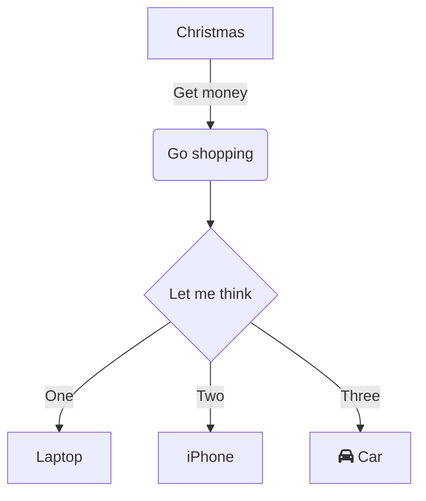

# instalar obsidian

- crear un vault (Boveda)
- introducción al lenguaje mark-up 
					#(numeral) nivel de título 1
					##(numeral) nivel de título 2
					-  lista bullet

**negritas**
*italica*

#  teclas de acceso rápido 

- (ctrl  / command = c) 
-  cE / prender apagar   modo edición
-  c, /  ir a la configuración 


# bloques

## código

```javascript

var a =  32;
b = 4;

function sumar (a,b) {
	return a + b
}

console.log(sumar(a,b));

```

## mapas mentales (mermaid)




## call-outs
> [!INFO] > Here's a callout block. > It supports **markdown** and [[Internal link|wikilinks]].

>[!danger] > now I know


### tipos
-   note
-   abstract, summary, tldr
-   info, todo
-   tip, hint, important
-   success, check, done
-   question, help, faq
-   warning, caution, attention
-   failure, fail, missing
-   danger, error
-   bug
-   example
-   quote, cite


# accesos rápidos en obsidian

```javascript

NAVEGACION

cP   abrir paleta de comandos
cO   quick switch
cE   edit / preview mode

PANELES
cN   crear un nuevo panel
cW   cerrar panel activo
```

- https://santiyounger.com/obsidian-shortcuts

- https://forum.obsidian.md/t/obsidian-hotkeys-favorites-and-best-practices/12125

- item 1
	- item 2
		- item 3

# embeds

https://www.youtube.com/watch?v=fwO8LzH9q3Ie


# construyendo el mapa mental

## backlinks, etiquetas o carpetas?

- **links**
	- los links son bidireccionales
	- los links crean una red, en vez de jerarquías.
	- puede haber múltiples links para una nota
- **tags**
	- no pertenencen a ninguna nota
	- el tag es el centro
	- múltiples tags para una nota
	- pueden crearse tags anidados

- **folders**
	- contienen notas
	- pueden estar anidadas
- si tenes dudas usa links
- los links proveen las conecciones mas firmes a tus ideas
- tags son ideales para evitar notas centrales, para status, para identificar estados e información especial
- las carpetas no son del todo útiles, mejor para esconder información y sintetizar la base de datos.
