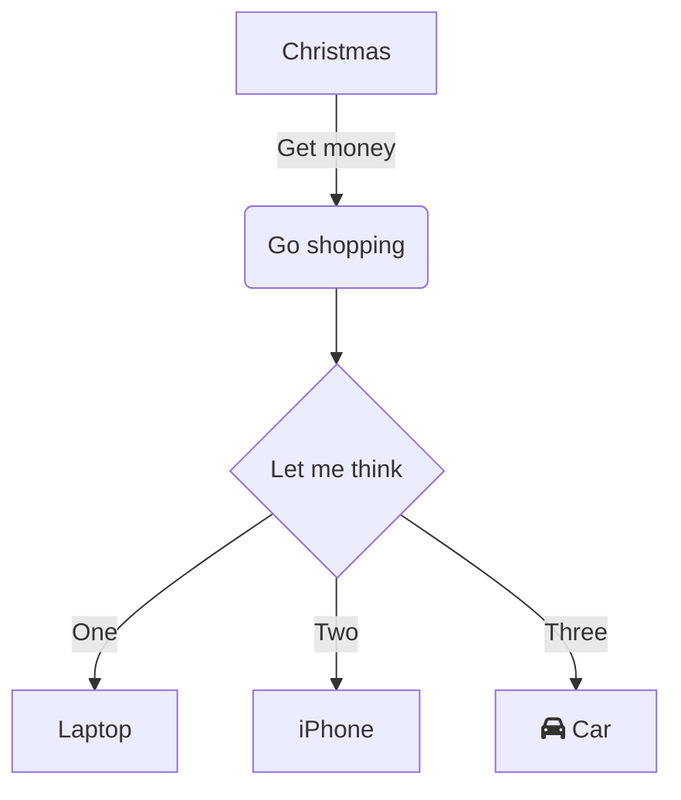

# paso 1 instalar obsidian

- crear un vault (Boveda)
- introducción al lenguaje mark-up 
					#(numeral) nivel de título 1
					##(numeral) nivel de título 2
					-  lista bullet

**negritas**
*italica*

## teclas de acceso rápido de obsidian

- (ctrl  / command = c) 
-  cE / prender apagar   modo edición
-  c, /  ir a la configuración 

```javascript

var a =  32;
b = 4;

function sumar (a,b) {
	return a + b
}

console.log(sumar(a,b));

```





# accesos rápidos en obsidian

```javascript

NAVEGACION

cP   abrir paleta de comandos
cO   quick switch
cE   edit / preview mode

PANELES
cN   crear un nuevo panel
cW   cerrar panel activo
```

- https://santiyounger.com/obsidian-shortcuts

- https://forum.obsidian.md/t/obsidian-hotkeys-favorites-and-best-practices/12125

- item 1
	- item 2
		- item 3
		- 