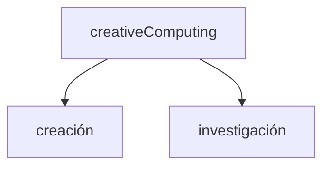

---
tags:
  - libro
title: Exploratory Programming for the Arts and Humanities
subtitle: ""
author: Nick Montfort
category: Computers
subject: 
publish: 2016-04-08
publisher: MIT Press
totalPage: 329
coverUrl: http://books.google.com/books/content?id=jxjvCwAAQBAJ&printsec=frontcover&img=1&zoom=1&edge=curl&source=gbs_api
description: A book for anyone who wants to learn programming to explore and create, with exercises and projects to help the reader learn by doing. This book introduces programming to readers with a background in the arts and humanities; there are no prerequisites, and no knowledge of computation is assumed. In it, Nick Montfort reveals programming to be not merely a technical exercise within given constraints but a tool for sketching, brainstorming, and inquiring about important topics. He emphasizes programming's exploratory potential—its facility to create new kinds of artworks and to probe data for new ideas. The book is designed to be read alongside the computer, allowing readers to program while making their way through the chapters. It offers practical exercises in writing and modifying code, beginning on a small scale and increasing in substance. In some cases, a specification is given for a program, but the core activities are a series of “free projects,” intentionally underspecified exercises that leave room for readers to determine their own direction and write different sorts of programs. Throughout the book, Montfort also considers how computation and programming are culturally situated—how programming relates to the methods and questions of the arts and humanities. The book uses Python and Processing, both of which are free software, as the primary programming languages.
isbn: 262331985
isbn13: 9780262331982
link: https://books.google.com/books/about/Exploratory_Programming_for_the_Arts_and.html?hl=&id=jxjvCwAAQBAJ
status: unread
colabs: cdp (2023)
---

Nick Montfort (poeta, artista y profesor de digital Media) trabaja en diversos proyectos artísticos incluyendo Web, publicación de libros y lectura literaria, exposiciones en galerías y live-coding.
Centrado en la poesía digital y en la generatividad Montfort analiza como ésta desafía y redefine no sólo el concepto de autoría, sino también los medios de publicación y presentación posdigital en diversos contextos y formatos.

*"Exploratory Programming for the Arts and Humanities"* muestra a la computación e informática dentro de la cultura (no como algo periférico), en relación a procesos de distintos proyectos artísticos. El autor toma a este libro como un sistema *human-book-computer*; una herramienta a-la-mano.

### Exploración vs/y explotación

Exploración como punto de partida en lo cotidiano, no sólo en lo artístico - informático, pudiendo aplicar los fundamentos de la programación:

- noción de sistema
- abstracción
- cálculos
- utilización de datos