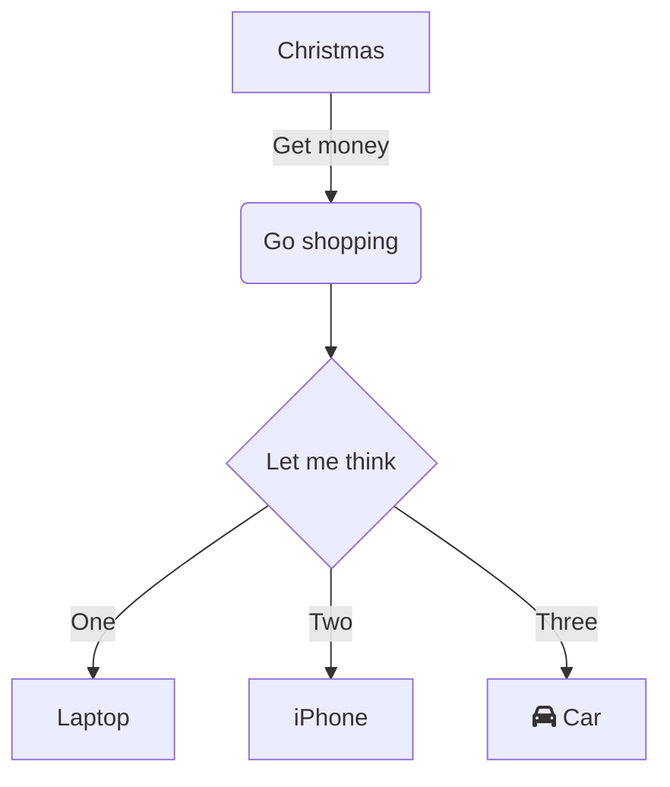

/toc

# instalar obsidian

## .gitignore

son los archivos recomendados para no sincronizar con github. Hasta ahora son estos:

En el raiz del vault (en general cym) crea un archivo llamado .gitignore y copia el siguiente texto:

```bash
.DS_Store
cym.bib
.obsidian/graph.json
.obsidian/plugins/recent-files-obsidian/data.json
.obsidian/workspace
.obsidian/plugins/execute-code/data.json

```

## execute-code

el plugin necesita definir las rutas de node.js y python para correr código dentro de obsidian.

### node .js

mac 
```
/usr/local/bin/node
```

windows
```
 C:\Program Files\nodejs\node.exe
```


# introducción al lenguaje mark-up 

control+E  // cambia entre modo edición y presentación

					#(numeral) nivel de título 1
					##(numeral) nivel de título 2
					-  lista bullet


**negritas**
*italica*

#  teclas de acceso rápido 

```bash

- (ctrl  / command = c) 
-  cE # prender apagar   modo edición
-  c, # ir a la c-onfiguración 
- csT # abrir tabla

```


# bloques

## código

```javascript

var a =  32;
b = 4;

function sumar (a,b) {
	return a + b
}

console.log(sumar(a,b));

```

## mapas mentales (mermaid)



## notas


```note

hello world

```

# checkbox raros (css agregado)

- [  ] sin chequear
- [x] chequeado ✅ 2023-09-14
- [>] diferido
- [-]  cancelado
- [?] need more info
- [!] important 
## call-outs

> [!INFO] > Here's a callout block. > It supports **markdown** and [[Internal link|wikilinks]].

>[!danger] > now I know


### tipos
-   note
-   abstract, summary, tldr
-   info, todo
-   tip, hint, important
-   success, check, done
-   question, help, faq
-   warning, caution, attention
-   failure, fail, missing
-   danger, error
-   bug
-   example
-   quote, cite

# transclusion

una de los pilares de la estructura wiki es la capacidad de embeber bloques de un archivo en otro. La información no se repite, se actualiza sincrónicamente y se re-utiliza. 

Para transcluir ingresar este código

```
![[<nombreDeArtículo#sección]]

```

# accesos rápidos en obsidian

```javascript

NAVEGACION

cP   abrir paleta de comandos
cO   quick switch
cE   edit / preview mode

PANELES
cN   crear un nuevo panel
cW   cerrar panel activo
```

- https://santiyounger.com/obsidian-shortcuts

- https://forum.obsidian.md/t/obsidian-hotkeys-favorites-and-best-practices/12125

- item 1
	- item 2
		- item 3

# embeds

https://www.youtube.com/watch?v=fwO8LzH9q3Ie


# construyendo el mapa mental

## backlinks, etiquetas o carpetas?

- **links**
	- los links son bidireccionales
	- los links crean una red, en vez de jerarquías.
	- puede haber múltiples links para una nota
- **tags**
	- no pertenencen a ninguna nota
	- el tag es el centro
	- múltiples tags para una nota
	- pueden crearse tags anidados

- **folders**
	- contienen notas
	- pueden estar anidadas
- si tenes dudas usa links
- los links proveen las conecciones mas firmes a tus ideas
- tags son ideales para evitar notas centrales, para status, para identificar estados e información especial
- las carpetas no son del todo útiles, mejor para esconder información y sintetizar la base de datos.

# wordnet diccionario

	;;<palabara a buscar>


	;;house

**house**
provide housing for; "The immigrants were housed in a new development outside the town"  


# experimental

## dataviewjs and heatcalendar

https://github.com/Richardsl/heatmap-calendar-obsidian/tree/master/EXAMPLE_VAULT


# ecuaciones matemáticas

... when $x < y$ we have ...

... we have 

$(x_1 = 132)$

and 
$(x_2 = 370)$ and so ...

$E = mc^2$

$e^{\pi i} + 1 = 0$

$\times$

$X_{n+1} = (a X_n + b)\, \textrm{mod}\, m$


# tablas

| New Column | New Column | New Column | New Column |
| ---------- | ---------- | ---------- | ---------- |
| hello      | lyric      |            |            |
| world      | joya       |            |            |
| sum        |            |            |            |

## funciones matemáticas

```functionplot
---
title: Graph
disableZoom: false
bounds: [-10, 10, -10, 10]
grid: true
xLabel: x
yLabel: y
---

f(x) = x^2
g(x) = 0.5*x^3+x^2-44
```


# list mode

=== start-multi-column: ExampleRegion4  
```column-settings  
number of columns: 3  
border: off  
```


=== end-column ===

# Column 2

=== end-column ===

# Column 3

=== end-multi-column ===

![[a-dataview]]


a::#inline


---